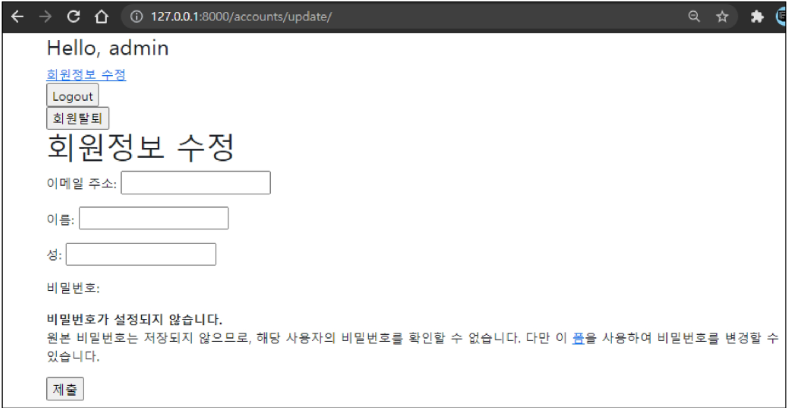

# AuthenticationSystem

> Django 인증 시스템

- settings.py에 포함된 INSTALLED_APPS 설정의 두 항목으로 구성됨
  - django.contrib.auth : 인증 프레임워크의 핵심과 기본 모델을 포함
  - django.contrib.contenttypes : 사용자가 생성한 모델과 권한을 연결할 수 있음
- 인증과 권한 부여를 함께 제공(처리)하며, 이러한 기능이 어느 정도 결합되어 일반적으로 인증 시스템이라고 함
  - Authentication(인증)
    - 신원 확인
    - 사용자가 자신이 누구인지 확인하는 것
  - Authorization(권한)
    - 권한 부여
    - 인증된 사용자가 수행할 수 있는 작업 결정
- 실습 시에는 두 번째 앱 'accounts' 생성하여 사용
  - app 이름이 반드시 accounts일 필요는 없으나 auth와 관련해 Django 내부적으로 accounts라는 이름으로 사용되고 있으므로 accounts로 지정하는 것 권장
  - 이후 app 등록 및 url 설정


## 쿠키와 세션

- HTTP 특징
  - 비연결지향(connectionless) : 서버는 요청에 대한 응답을 보낸 후 연결을 끊음
  - 무상태(stateless) : 연결을 끊는 순간 클라이언트와 서버 간의 통신이 끝나며 상태 정보가 유지되지 않음, 클라이언트와 서버가 주고 받는 메시지들은 서로 완전히 독립적임
  - 클라이언트와 서버의 지속적인 관계를 유지하기 위해 쿠키와 세션이 존재


#### 쿠키

> 서버가 사용자의 웹 브라우저에 전송하는 작은 데이터 조각

- 사용자가 웹사이트를 방문할 경우 해당 웹사이트의 서버를 통해 사용자의 컴퓨터에 설치되는 작은 기록 정보 파일
  - 브라우저(클라이언트)는 쿠키를 로컬에 KEY-VALUE의 데이터 형식으로 저장
  - 쿠키 저장해 놓고 동일 서버에 재요청시 저장된 쿠키 함께 전송
- HTTP 쿠키는 상태가 있는 세션을 만들어 줌
  - HTTP는 상태가 존재하지 않기 때문에 상태가 유지되고 있는 것처럼 보이기 위해
- 두 요청이 동일한 브라우저에서 들어왔는지 아닌지를 판단할 때 주로 사용
- 웹 페이지에 접속하면 요청한 웹 페이지를 받으며 쿠키를 저장하고, 클라이언트가 같은 서버에 재요청시 요청과 함께 쿠키도 전송
- 사용목적 
  - 세션 관리 : 로그인, 자동 완성, 공지 하루 안보기, 팝업 체크, 장바구니 등 정보 관리
  - 개인화 : 사용자 선호, 테마 등 설정
  - 트래킹 : 사용자 행동 기록 및 분석
- 개발자 도구를 이용한 쿠키 관리
  - 쿠키 확인 : 개발자 도구 - Network 탭 - Name에서 쿠키 클릭 - Cookies
  - 쿠키 삭제 : 개발자 도구 - Application 탭 - Cookies - RMB - Clear 후 새로고침
- 수명
  - Session cookies : 현재 세션 종료시 삭제
  - Persistent cookies : 만료 기간이 되면 삭제


#### 세션

> 사이트와 특정 브라우저 사이의 "상태"를 유지시키는 것

- 쿠키의 첫 번째 사용 목적과 관련
- 클라리언트가 서버에 접속하면 서버가 특정 session id를 발급하고, 클라이언트는 발급 받은 session id를 쿠키에 저장
- ID는 세션을 구별하기 위해 필요하며, 쿠키에는 ID만 저장
- 개발자 도구 - Application 탭 - 서버로부터 받아 저장된 session 쿠키 확인
- 세션을 삭제한 후 페이지를 새로고침하면 로그아웃 상태 변경 확인 가능
- Django에서 세션은 미들웨어를 통해 구현되며, database-backed sessions 저장 방식을 기본 값으로 사용한다
  - MIDDLEWARE : HTTP 요청과 응답 처리 중간에서 작동하는 시스템으로, Djangos는 HTTP 요청이 들어오면 미들웨어를 거쳐 해당 URL에 등록되어 있는 view로 연결해주고, HTTP 응답 역시 미들웨어를 거쳐 내보냄
  - settings.py의 MIDDLEWARE에서 SessionMiddleware(요청 전반에 걸쳐 세션 관리), AuthenticationMiddleware(세션을 사용하여 사용자를 요청과 연결)


## Django에서의 Authentication System

#### 로그인

> 사용자의 요청정보를 바탕으로 로그인하는 과정, session을 Create하는 로직과 같음

- AuthenticationForm

  - 사용자 로그인을 위한 form
  - request를 첫번째 인자로 취함

- login(request, user, backend=None)

  - 현재 세션에 연결하려는 인증된 사용자가 있는 경우 login() 함수가 필요
  - view 함수에서 사용됨

- get_user()

  - AuthenticationForm의 인스턴스 메서드
  - 인스턴스 생성 시 None으로 할당되며, 유혀성 검사를 통과했을 경우 로그인한 사용자 객체로 할당됨
  - 인스턴스가 유효할 때만 user를 제공하려는 구조

- 로그인 사용자 접근 제한

  1. is_authenticated 속성

     - 모든 User 인스턴스에 대해 항상 True인 읽기 전용 속성

     - 사용자가 인증되었는지 여부 확인 가능

     - 일반적으로 request.user에서 이 속성을 사용

     - 권한, 사용자 활성화 상태, 유효한 세션을 가졌는지 여부 확인 불가능

     - 적용 - 로그인과 비로그인 상태에서 출력되는 링크를 다르게

       ```django
       <!-- base.html -->
       
        {# is_authenticated 속성 #}
           <h3>Hello, {{ user }}</h3> 
       
           <a href="">Login</a>
       
       ```

     - 적용2 - 로그인한 상태라면 로그인 로직을 수행할 수 없도록 views 처리

       ```python
       # accounts/views.py
       
       if request.user.is_authenticated:
           return redirect('articles:index')
       ```

     - 적용3 - 로그인 상태에서만 게시글 작성할 수 있도록 처리

       ```django
       <!-- articles/index.html -->
       
       
       	<a href="">CREATE</a>
       
       	<a href="">[새 글을 작성하려면 로그인 하세요]</a>
       
       ```

  2. login_required decorator

     - 사용자가 로그인되어 있지 않으면 settings.LOGIN_URL에 설정된 문자열 기반 절대 경로로 redirect함

     - 사용자가 로그인되어 있으면 정상적으로 view 함수 실행

     - 인증 성공시 redirect 되어야하는 경로는 "next"라는 쿼리 문자열 매개 변수에 저장됨

       ```python
       # articles/views.py
       
       from django.contrib.auth.decorators import login_required
       
       @login_required
       @require_http_methods(['GET', 'POST'])
       def create(request):
           ...
           
       @login_required
       @require_http_methods(['GET', 'POST'])
       def update(request, pk):
           ...
       ```

       - delete의 경우 @required_POST와 @login_required 함께 사용시 비로그인 상태에서 시도 -> 로그인 페이지로 이동해 로그인 시도 -> 405 error 발생

         - 로그인 이후 next 매개변수를 따라 해당 함수로 다시 redirect되는데 이 때 @require_POST 때문에 에러가 발생하는 것
         - 해결방법

         ```python
         @require_POST
         def delete(request, pk):
             if request.user.is_authticated:
                 article = get_object_or_404(Article, pk=pk)
                 article.delete()
             return redirect('articles:index')
         ```

     - "next" query string parameter

       - 로그인이 정상적으로 진행되면 기존에 요청했던 주소로 redirect하기 위해 주소를 keep해주는 것

       - 별도로 처리해주지 않으면 우리가 view에 설정한 redirect 경로로 이동

       - `return redirect(request.GET.get('next') or 'articles:index')`

         ```django
         <!-- accounts/login.html -->
         
         
         
         
           <h1>로그인</h1>
           <hr>
           <form action="" method="POST">
             
             {{ form.as_p }}
             <input type="submit">
           </form>
           <a href="">back</a>
         
         ```

- views.py 최종 정리

  ```python
  # accounts/views.py
  
  from django.contrib.auth.forms import AuthenticationForm # 1. form import
  from django.contrib.auth import login as auth_login # 2. 로그인 함수 import
  from django.views.decorators.http import require_http_methods, require_POST
  from django.shortcuts import render, redirect
  
  @require_http_methods(['GET', 'POST'])
  def login(request):
      if request.method == 'POST':
          form = AuthenticationForm(request, request.POST) # 1. 기존 create에서 form만 바뀜
          if form.is_valid():
              auth_login(request, form.get_user()) # 2. 로그인 함수 사용 # 3. get_user()
              return redirect(request.GET.get('next') or 'articles:index') # 4-2. next가 있으면 해당 주소로, 없으면 index로 넘어감
      else:
          form = AuthenticationForm() #
      context = {
          'form': form,
      }
      return render(request, 'accounts/login.html', context)
  ```

  - 전체적으로 html만 바꿔주면 주소창에 직접 치고 들어갈 수 있으므로 반만 완성된 코드라고 볼 수 있음 -> @login_required 등의 사용으로 view를 꼭 함께 바꾸어주어야 한다


#### 로그아웃

> session을 delete하는 로직과 같음

- logout(request)

  - HttpRequest 객체를 인자로 받고 반환 값이 없음
  - 현재 요청에 대한 session data를 DB에서 완전히 삭제하고 클라이언트의 쿠키에서도 삭제
    - 다른 사람이 이전 사용자의 세션 데이터에 엑세스하는 것을 방지하기 위함

- 로그아웃은 로그인 한 사람만 할 수 있도록 `is_authenticated` 사용

- 정리

  ```python
  # accounts/views.py
  
  from django.contrib.auth import logout as auth_logout # 1. logout import
  
  @require_POST
  def logout(request):
      if request.user.is_authenticated: # 2. 접근 제한
          auth_logout(request) # 1. logout 함수
      return redirect('articles:index')
  ```

  ```django
  <!-- base.html -->
  
  
      <h3>Hello, {{ user }}</h3> 
      <form action="" method="POST"> {# 추가 #}
          
          <input type="submit" value="Logout">
      </form>
  
      <a href="">Login</a>
  
  ```


#### 회원가입

- UserCreationForm

  - 주어진 username과 password로 권한이 없는 새 user를 생성하는 ModelForm
  - 3개의 필드(username, password1, password2)를 가짐

- 로그인되어 있으면 회원가입 못하도록 `is_authenticated` 사용

- 회원가입한 후 로그인

  - 로그인 자동으로

    ```python
    if form.is_valid():
        user = form.save()
        auth_login(request, user)
        return redirect('articles:index')
    ```

  - 로그인 직접 시키려면

    ```python
    if form.is_valid():
        user = form.save()
        return redirect('accounts:login')
    ```

- 정리

  ```python
  # accounts/views.py
  
  from django.contrib.auth.forms import UserCreationForm
  
  @require_http_methods(['GET', 'POST'])
  def signup(request):
      if request.user.is_authenticated:
          return redirect('articles:index')
  
      if request.method == 'POST':
          form = UserCreationForm(request.POST)
          if form.is_valid():
              user = form.save()
              auth_login(request, user)
              return redirect('articles:index')
      else:
          form = UserCreationForm()
      context = {
          'form': form,
      }
      return render(request, 'accounts/signup.html', context)
  ```

  ```django
  <!-- base.html -->
  
  
      <h3>Hello, {{ user }}</h3> 
      <form action="" method="POST">
          
          <input type="submit" value="Logout">
      </form>
  
      <a href="">Login</a>
  	<a href="">Signup</a> {# 추가 #}
  
  ```

  ```django
  <!-- accounts/signup.html -->
  
  
  
  
    <h1>회원가입</h1>
    <hr>
    <form action="" method="POST">
      
      {{ form.as_p }}
      <input type="submit">
    </form>
    <a href="">back</a>
  
  ```
  
  

#### 회원 탈퇴

> DB에서 사용자를 삭제하는 것과 같음

- 탈퇴 이후 해당 유저의 세션 데이터를 함께 지우기 위해 로그아웃 함수 호출(필수는 아니지만 세션 데이터가 사라지기까지 쌓이는 것이 싫다면)
  - `auth_logout(request)`

```python
# accounts/views.py

@require_POST
def delete(request):
    if request.user.is_authenticated:
        request.user.delete()
        auth_logout(request) # 1. 로그아웃 함수 호출
    return redirect('articles:index')
```

```django
<!-- base.html -->


    <h3>Hello, {{ user }}</h3> 
    <form action="" method="POST">
        
        <input type="submit" value="Logout">
    </form>
    <form action="" method="POST"> {# 추가 #}
        
        <input type="submit" value="회원탈퇴">
    </form>

    <a href="">Login</a>
	<a href="">Signup</a>

```


#### 회원정보 수정



- UserChangeForm : 사용자의 정보 및 권한을 변경하기 위해 admin 인터페이스에서 사용되는 ModelForm

  - 하지만 회원정보 수정 시 UserChangeForm을 사용한다면?
    - 일반 사용자가 접근해서는 안될 정보(필드)들까지 모두 수정이 가능
      - 최상위 사용자 권한, 스태프 권한, 사용자 활성, 등록일 등
    - 따라서 UserChangeForm을 상속받아 CustomUserChangeForm이라는 서브클래스 작성해 접근 가능한 필드를 조정

- CustomUserChangeForm

  - get_user_model()
    - 현재 프로젝트에서 활성화된 사용자 모델 반환
    - Django에서는 User 클래스를 직접 참조하는 대신 django.contrib.auth.get_user_model()을 사용하여 참조해야 한다고 강조
  - User 모델의 fields

  ```python
  from django.contrib.auth.forms import UserChangeForm
  from django.contrib.auth import get_user_model # User
  
  
  class CustomUserChangeForm(UserChangeForm):
  
      class Meta:
          model = get_user_model() # User
          fields = ('email', 'first_name', 'last_name',) # 필요한 필드만 선택
  ```

- 정리

  ```python
  # accounts/views.py
  
  from django.contrib.auth.decorators import login_required
  from .forms import CustomUserChangeForm
  
  @login_required
  @require_http_methods(['GET', 'POST'])
  def update(request):
      if request.method == 'POST':
          form = CustomUserChangeForm(request.POST, instance=request.user)
          if form.is_valid():
              form.save()
              return redirect('articles:index')
      else:
          form = CustomUserChangeForm(instance=request.user)
      context = {
          'form': form,
      }
      return render(request, 'accounts/update.html', context)
  ```

  ```django
  <!-- base.html -->
  
  
      <h3>Hello, {{ user }}</h3> 
      <form action="" method="POST">
          
          <input type="submit" value="Logout">
      </form>
  	<a href="">회원정보수정</a> {# 추가 #}
      <form action="" method="POST">
          
          <input type="submit" value="회원탈퇴">
      </form>
  
      <a href="">Login</a>
  	<a href="">Signup</a>
  
  ```

  ```django
  <!-- accounts/update.html -->
  
  
  
    <h1>회원정보수정</h1>
    <hr>
    <form action="" method="POST">
      
      {{ form.as_p }}
      <input type="submit">
    </form>
    <a href="">back</a>
  
  ```
  
  

##### 비밀번호 변경

- 비밀번호는 특별한 폼을 사용하여 변경해야 함

  - PasswordChangeForm
    - 사용자가 비밀번호를 변경할 수 있도록 하는 Form
    - 옛날 비밀번호 맞는지 확인 -> 비밀번호 두개가 맞는지 확인

- update_session_auth_hash(request, user)

  - 암호 변경시 세션 무효화 방지
  - 비밀번호가 변경되면 기존 세션과의 회원 인증 정보가 일치하지 않으므로 로그인 상태를 유지할 수 없기 때문에 사용
  - 암호가 변경되어도 로그아웃되지 않도록 새로운 password hash로 session을 업데이트함

- 정리

  ```python
  # accounts/views.py
  
  from django.contrib.auth.forms import PasswordChangeForm # 1.
  from django.contrib.auth import update_session_auth_hash # 2.
  
  @login_required
  @require_http_methods(['GET', 'POST'])
  def change_password(request):
      if request.method == 'POST':
          form = PasswordChangeForm(request.user, request.POST) # 1. 
          if form.is_valid():
              user = form.save()
              update_session_auth_hash(request, user) # 2.
              return redirect('articles:index')
      else:
          form = PasswordChangeForm(request.user)
      context = {
          'form': form,
      }
      return render(request, 'accounts/change_password.html', context)
  ```
  ```django
  <!-- accounts/change_password.html -->
  
  
  
    <h1>비밀번호변경</h1>
    <hr>
    <form action="" method="POST">
      
      {{ form.as_p }}
      <input type="submit">
    </form>
    <a href="">back</a>
  
  ```
  
  