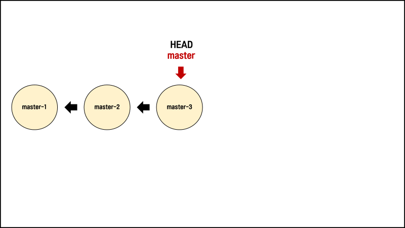
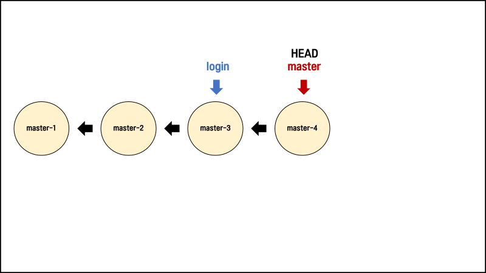
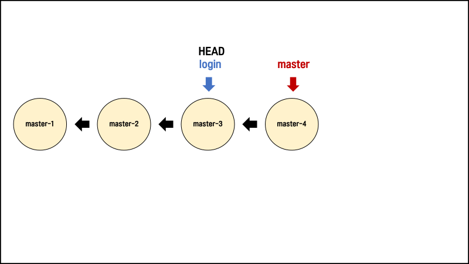
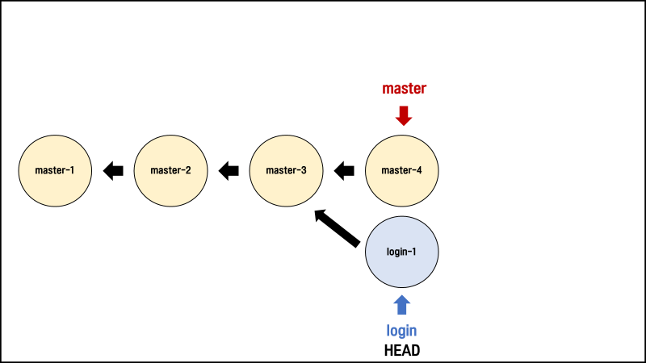

# Branch

> 나뭇가지처럼 여러 갈래로 작업 공간을 나누어 독립적으로 작업할 수 있도록 도와주는 Git의 도구

- https://git-scm.com/book/en/v2/Git-Branching-Branches-in-a-Nutshell
- 개발을 하다 보면 코드를 여러 개로 복사해야 하는 일이 자주 생기는데, 코드를 통째로 복사하고 나서 원래 코드와는 상관없이 독립적으로 개발을 진행할 수 있도록 도움


## 브랜치를 꼭 써야할까?

- 장점
  - 독립 공간을 형성하기 때문에 원본(master)에 대해 안전
  - 하나의 작업은 하나의 브랜치로 나누어 진행되므로 체계적인 개발 가능
  - 특히 Git의 브랜치는 매우 가벼우며 순식간에 브랜치를 새로 만들고 브랜치 사이를 이동할 수 있음

1. 일단 master 브랜치는 상용을 의미합니다. 그래서 언제든 세상에 공개되어 있습니다.
2. 만약 상용에 에러가 있어서 고쳐야 한다면 어떻게 해야할까요?
3. 고객들이 사용하고 있는데, 함부로 버전을 되돌리거나 삭제할 수 있을까요?
4. 따라서 브랜치를 통해 별도의 작업 공간을 만들고, 그곳에서 되돌리거나 삭제를 합니다.
5. 브랜치는 완전하게 독립이 되어있어서 어떤 작업을 해도 master에는 영향을 끼치지 못하죠.
6. 그리고 이후에 에러를 해결했다면? 그 내용을 master에 반영할 수도 있습니다!
7. 이러한 이유 때문에 Git에서 브랜치는 정말 강력한 기능 중의 하나라고 할 수 있습니다.


## Branch command

#### branch

- git branch : 브랜치 목록 확인
- git branch -r : 원격 저장소의 브랜치 목록 확인
- git branch '브랜치이름' : 새로운 브랜치 생성
- git branch -d '브랜치이름' : 특정 브랜치 삭제(병합된 브랜치만 삭제)
- git branch -D '브랜치이름' : 강제 삭제(병합되지 않은 브랜치도 삭제 가능하므로 주의)

#### switch

- git switch '브랜치이름' : 다른 브랜치로 이동
- git switch -c '브랜치 이름' : 브랜치를 새로 생성과 동시에 이동

#### log

- git log --oneline : 로그를 한줄로(약식으로) 보여줌
- git log --oneline --all : 누락된 것 없이 전체를 보고싶을 때
- git log --oneline --all --graph : 로그를 그래프 형식으로 보여줌(가지가 어떻게 뻗어나가는지까지 확인 가능)


## Branch scenario

> git branch와 git switch를 통해 브랜치를 조회, 생성, 이동하는 과정

#### (1) 사전 세팅

1. 홈 디렉토리에 git-branch-practice 폴더를 생성하고 이동 후 vscode 열기

   ```bash
   $ mkdir git-branch-practice
   $ cd git-branch-practice
   $ code .
   ```

2. Git 저장소 생성

   ```bash
   $ git init
   Initialized empty Git repository in C:/Users/kyle/git-branch-practice/.git/
   ```

3. test.txt 생성 후 master-1, master-2, master-3이라는 내용을 순서대로 입력하여 커밋 3개 작성

   ```bash
   $ touch test.txt
   
   # test.txt에 master-1 작성
   $ git add .
   $ git commit -m 'master-1'
   
   # test.txt에 master-2 작성
   $ git add .
   $ git commit -m 'master-2'
   
   # test.txt에 master-3 작성
   $ git add .
   $ git commit -m 'master-3'
   ```

4. `git log --oneline`을 입력하여 다음과 같이 나오는지 확인(3개의 버전이 master 브랜치에 만들어짐)

   ```bash
   $ git log --oneline
   0604dcd (HEAD -> master) master-3
   9c22c89 master-2
   3d71510 master-1
   ```

5. 현재 모습




#### (2) 브랜치 생성 및 조회

1. 현재 위치(master 브랜치의 최신 커밋)에서 login이라는 이름으로 브랜치 생성

   ```bash
   $ git branch login
   ```

2. login 브랜치 잘 생성되었는지 확인(`* master`의 의미는 현재 HEAD가 가리키는 브랜치는 `master`라는 뜻)

   ```bash
   $ git branch
     login
   * master
   ```

3. `git log --oneline`을 입력하여 다음과 같이 나오는지 확인(`0604dcd` 커밋 기준으로 `login` 브랜치가 위치함)

   ```bash
   $ git log --oneline
   0604dcd (HEAD -> master, login) master-3
   9c22c89 master-2
   3d71510 master-1
   ```

4. `master` 브랜치에서 1개의 커밋을 더 작성

   ```bash
   # test.txt에 master-4 작성
   $ git add.
   $ git commit -m 'master-4'
   ```

5. 현재 브랜치와 커밋 상태 확인

   ```bash
   $ git log --oneline
   5ca7701 (HEAD -> master) master-4
   0604dcd (login) master-3
   9c22c89 master-2
   3d71510 master-1
   ```

6. 현재까지 결과

   

   

#### (3) 브랜치 이동

1. 현재 브랜치와 커밋의 상태

   ```bash
   $ git log --oneline
   5ca7701 (HEAD -> master) master-4
   0604dcd (login) master-3
   9c22c89 master-2
   3d71510 master-1
   ```

2. login 브랜치로 이동하면?

   ```bash
   $ git switch login
   ```

3. master 브랜치의 test.txt에 작성한 master-4가 지워짐

   ```bash
   # login 브랜치의 test.txt 모습
   
   master-1
   master-2
   master-3
   ```

4. `git log --oneline`을 입력하면? HEAD는 `login` 브랜치를 가리키고 `master` 브랜치는 보이지 않음

   ```bash
   $ git log --oneline
   0604dcd (HEAD -> login) master-3
   9c22c89 master-2
   3d71510 master-1
   ```

5. master 브랜치는 삭제되었나? 브랜치를 조회해보자. HEAD가 `login` 브랜치를 가리키면서 log도 `login` 브랜치를 기준으로 보이는 것

   ```bash
   $ git branch
   * login
     master
   ```

6. `git log --oneline --all`을 입력하여 모든 브랜치 로그를 살펴보면?

   ```bash
   $ git log --oneline --all
   5ca7701 (master) master-4
   0604dcd (HEAD -> login) master-3
   9c22c89 master-2
   3d71510 master-1
   ```

7. 현재까지 결과

   

> 브랜치를 이동한다는건 HEAD가 해당 브랜치를 가리킨다는 것을 의미하고, 
>
> 브랜치는 최신 커밋을 가리키므로, HEAD가 해당 브랜치의 최신 커밋을 가리키게 된다
>
> 따라서 워킹 디렉토리의 내용도 HEAD가 가리키는 브랜치의 최신 커밋 상태로 변화


#### (4) login 브랜치에서 커밋 생성

1. test.txt 파일에 login-1 작성

   ```bash
   # login 브랜치의 test.txt
   master-1
   master-2
   master-3
   login-1
   ```

2. 추가적으로 test_login.txt도 생성하고 login-1이라고 작성

   ```bash
   $ touch test_login.txt
   
   # 이후 test_login.txt에 작성
   login-1
   ```

3. 커밋 생성

   ```bash
   $ git add .
   $ git commit -m "login-1"
   ```

4. `git log --oneline --all --graph`를 통해 아래와 같은 내용 확인. `master` 브랜치와 `login` 브랜치가 다른 갈래로 갈라진 것을 확인할 수 있다

   ```bash
   $ git log --oneline --graph --all
   * 3b0a091 (HEAD -> login) login-1
   | * 5ca7701 (master) master-4
   |/
   * 0604dcd master-3
   * 9c22c89 master-2
   * 3d71510 master-1
   ```

5. 현재까지 결과

   
