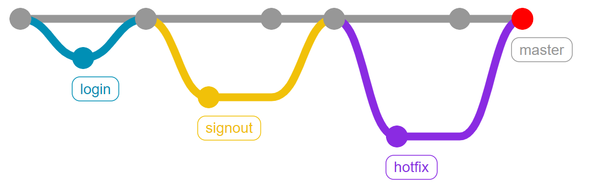
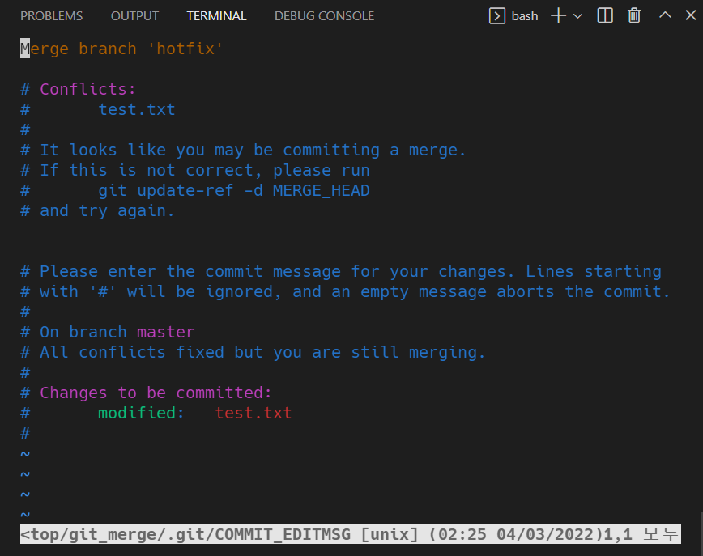

# BranchMerge

> 브랜치 작업이 끝난 후 작업 내용을 master에 반영(브랜치를 합치는)하는 과정


## git merge

- 분기된 브랜치들을 하나로 합치는 명령어
- `git merge '병합할 브랜치 이름'`
- **merge 전에 일단 다른 브랜치를 합치려고 하는 '메인브랜치' 로 switch해야 함**


## 종류

#### 1. Fast-Forward

- 브랜치를 병합할 때 빨리감기하는 것처럼 브랜치가 가리키는 커밋을 앞으로 이동시키는 것
- 예시
  - 현재 master는 C2 커밋을, hotfix는 C4 커밋을 가리키고 있다
  - master에 hotfix를 병합하면?
  - hotfix가 가리키는 C4는 C2에 기반한 커밋이므로, master가 C4로 이동
  - 병합이 완료된 hotfix는 더 이상 필요 없으므로 삭제
  - Fast-Forward == 이처럼 따로 merge 과정 없이 브랜치 포인터가 이동하는 것

#### 2. 3-way Merge(Merge Commit)

- 커밋 세개(커밋 두개와 둘의 공통된 조상 하나)를 기준으로 merge
- 두 브랜치에서 다른 파일 혹은 같은 파일의 다른 부분을 수정했을 때 가능
- merge 후 commit해서 merge commit이라고 부름
- 예시
  - master는 C4 커밋을, iss53은 C5 커밋을 가리키고 있다, master와 iss53의 공통 조상은 C2 커밋이다
  - master에 iss53을 병합하면?
  - master와 iss53은 갈래가 나누어져 있으므로 Fast-Forward로 합쳐질 수 없음
  - 공통 조상인 C2가 각자가 가리키는 커밋인 C4와 C5를 비교하여 3-way merge를 진행
  - 이때 생긴 C6은 master와 iss53이 병합되며 발생한 merge commit이다
  - 병합이 완료된 iss53은 더 이상 필요 없으므로 삭제


#### 3. Merge Conflict

- merge하는 두 브랜치에서 같은 파일의 같은 부분을 동시에 수정하고 merge하면 Git은 어느 브랜치의 내용으로 작성해야할지 판단하지 못해 해당 부분을 자동으로 merge해주지 못함

- 반면 동일 파일이더라도 서로 다른 부분을 수정했다면 conflict 없이 자동으로 merge commit 된다

- merge conflict가 발생하면 결국 사용자가 직접 내용을 선택하여 conflict를 해결해야 한다

- 예시

  - master는 C4 커밋을, iss53은 C5 커밋을 가리키고 있다, master와 iss53의 공통 조상은 C2 커밋이다

  - 만약 master와 iss53이 같은 파일의 같은 부분을 수정하고 있는데 병합한다면?

    ```bash
    $ git merge iss53
    Auto-merging index.html
    CONFLICT (content): Merge conflict in index.html
    Automatic merge failed; fix conflicts and then commit the result.
    
    ```

  - 충돌이 일어난 파일 확인 위해 git status

    ```bash
    $ git status
    On branch master
    You have unmerged paths.
      (fix conflicts and run "git commit")
    
    Unmerged paths:
      (use "git add <file>..." to mark resolution)
    
        both modified:      index.html
    
    no changes added to commit (use "git add" and/or "git commit -a")
    
    ```

  - `index.html` 열어보면?

    ```bash
    <<<<<<< HEAD:index.html
    <div id="footer">contact : email.support@github.com</div>
    =======
    <div id="footer">
     please contact us at support@github.com
    </div>
    >>>>>>> iss53:index.html
    ```

  - `=======`를 기준으로 위는 master 내용, 아래는 iss53의 내용

  - 이 중 하나를 선택할 수도 있고, 아예 새롭게 작성할 수도 있다

  - 이후 git add와 git commit을 통해 병합한 내용 커밋 가능

  - Vim 편집기가 켜지며 이를 이용해 커밋 내역을 수정할 수 있다(수정을 마치거나 수정할 것이 더이상 없을 경우 `esc`를 누른 후 `:wq`를 입력하여 저장&종료)


## Branch Merge Scenario

#### 사전 세팅

```bash
$ mkdir git_merge
$ cd git_merge

$ git init
$ touch test.txt

# test.txt 에 master test 1 을 입력 후 저장

$ git status
$ git add .

$ git commit -m "master test 1"
```


#### (1) Fast-Forward

> login 브랜치가 생성된 이후 master 브랜치에 변경 사항이 없는 상황
>
> master 브랜치에서 login 브랜치를 Merge할 때 login 브랜치가 master 브랜치 이후의 커밋을 가리키고 있으면 그저 master 브랜치가 login 브랜치와 동일한 커밋을 가리키도록 이동시킬 뿐


1. login branch 생성 및 이동

   ```bash
   $ git switch -c login
   ```

2. 특정 작업 완료 후 commit

   ```bash
   $ touch login.txt
   $ git add .
   $ git commit -m 'login test 1'
   ```

3. master 브랜치로 이동

   ```bash
   $ git switch master
   
   git log --oneline --all --graph
   * df231d0 (login) login test 1
   * 1e62b4c (HEAD -> master) master test 1
   ```

4. master에 병합 login을 병합

   ```bash
   $ git merge login
   
   Updating 43fab3e..2fe539c
   Fast-forward
    login.txt | 0
    1 file changed, 0 insertions(+), 0 deletions(-)
    create mode 100644 login.txt
   ```

5. 결과 확인(fast-forward)

   ```bash
   $ git log --oneline --all --graph
   * 2fe539c (HEAD -> master, login) login test 1
   * 43fab3e master test 1
   ```

6. login 브랜치 삭제

   ```bash
   $ git branch -d login
   Deleted branch login (was df231d0).
   
   $ git log --oneline --all --graph
   * 2fe539c (HEAD -> master) login test 1
   * 43fab3e master test 1
   ```


#### (2) 3-way Merge

> 현재 브랜치(master)가 가리키는 커밋이 Merge할 브랜치의 조상이 아니면, git은 각 브랜치가 가리키는 커밋 2개와 공통조상 하나를 사용하여 3-way Merge를 한다
>
> 단순히 브랜치 포인터를 최신 커밋으로 옮기는게 아니라 3-way Merge의 결과를 별도 커밋으로 만들고 나서 해당 브랜치가 그 커밋을 가리키도록 이동시킨다. 그래서 이런 커밋은 부모가 여러 개고 Merge Commit이라 부른다


1. signout 브랜치 생성 및 이동

   ```bash
   $ git switch -c signout
   ```

2. 특정 작업 완료 후 commit

   ```bash
   $ touch signout.txt
   
   $ git add .
   $ git commit -m "signout test 1"
   [signout d9f33e2] signout test 1
    1 file changed, 0 insertions(+), 0 deletions(-)
    create mode 100644 signout.txt
   
   $ git log --oneline --all --graph
   * d9f33e2 (HEAD -> signout) signout test 1
   * 2fe539c (master) login test 1
   * 43fab3e master test 1
   ```

3. master 브랜치 이동

   ```bash
   $ git switch master
   ```

4. master에 추가 작업 후 commit(단, signout 브랜치와 다른 파일을 생성 혹은 수정)

   ```bash
   $ touch master.txt
   
   $ git add .
   $ git commit -m "master test 2"
   
   $ git log --oneline --all --graph
   * 07fae72 (HEAD -> master) master test 2
   | * d9f33e2 (signout) signout test 1
   |/
   * 2fe539c login test 1
   * 43fab3e master test 1
   ```

5. master에 signout을 병합(자동 merge commit 발생)

   ```bash
   $ git merge signout
   Merge made by the 'recursive' strategy.
    signout.txt | 0
    1 file changed, 0 insertions(+), 0 deletions(-)
    create mode 100644 signout.txt
   ```

6. log 확인

   ```bash
   $ git log --oneline --all --graph
   *   1170a02 (HEAD -> master) Merge branch 'signout'
   |\  
   | * d9f33e2 (signout) signout test 1
   * | 07fae72 master test 2
   |/  
   * 2fe539c login test 1
   * 43fab3e master test 1
   ```

7. signout 브랜치 삭제

   ```bash
   $ git branch -d signout
   Deleted branch signout (was d9f33e2).
   ```


#### 3. Merge Conflict

> Merge하는 두 브랜치에서 같은 파일의 같은 부분을 동시에 수정하고 Merge하면 Git은 해당 부분을 자동으로 Merge하지 못하고 충돌이 일어남(반면 동일 파일이더라도 서로 다른 부분을 수정했다면, Conflict 없이 자동으로 Merge Commit된다)



1. hotfix 브랜치 생성 및 이동

   ```bash
   $ git switch -c hotfix
   ```

2. 특정 작업 완료 후 commit

   ```bash
   # test.txt 수정
   
   master test 1
   이건 hotfix 에서 작성한 문장이에요!!
   ```

   ```bash
   $ git add .
   
   $ git commit -m "hotfix test 1"
   [hotfix e6cf5ec] hotfix test 1
    1 file changed, 2 insertions(+)
   
   $ git log --graph --oneline --all
   * e6cf5ec (HEAD -> hotfix) hotfix test 1
   *   1170a02 (master) Merge branch 'signout'
   |\
   | * d9f33e2 signout test 1
   * | 07fae72 master test 2
   |/
   * 2fe539c login test 1
   * 43fab3e master test 1
   ```

3. master 브랜치로 이동

   ```bash
   $ git switch master
   ```

4. 특정 작업(hotfix와 동일 파일의 동일 부분 수정) 완료 후 commit

   ```bash
   # text.txt 수정
   
   master test 1
   이건 master 에서 작성한 코드에용ㅎㅎ!!
   ```

   ```bash
   $ git add .
   $ git commit -m "master test 3"
   
   $ git log --oneline --all --graph
   * 1bc2eeb (HEAD -> master) master test 3
   | * e6cf5ec (hotfix) hotfix test 1
   |/
   *   1170a02 Merge branch 'signout'
   |\
   | * d9f33e2 signout test 1
   * | 07fae72 master test 2
   |/
   * 2fe539c login test 1
   * 43fab3e master test 1
   ```

5. master에 hotfix 병합

   ```bash
   $ git merge hotfix
   ```

6. 결과 : `merge conflict` 발생 (같은 파일의 같은 문장을 수정했기 때문)

7. 충돌 확인 및 해결

   - Merge 충돌이 일어났을 때 Git이 어떤 파일을 Merge할 수 없었는지 살펴보려면 git status 명령을 이용

     ```bash
     $ git status
     On branch master
     You have unmerged paths.
       (fix conflicts and run "git commit")
       (use "git merge --abort" to abort the merge)
     
     Unmerged paths:
       (use "git add <file>..." to mark resolution)
             both modified:   test.txt
     
     no changes added to commit (use "git add" and/or "git commit -a") 
     ```

     ```bash
     master test 1
     <<<<<<< HEAD
     이건 master 에서 작성한코드에용ㅎㅎ!!
     =======
     이건 hotfix 에서 작성한문장이에요!!
     >>>>>>> hotfix
     ```

   - `======` 위쪽의 내용은 HEAD 버전(merge 명령을 실행할 때 작업하던 master 브랜치)의 내용이고 아래쪽은 `hotfix` 브랜치의 내용이다. 충돌을 해결하려면 위쪽이나 아래쪽 내용 중에서 고르거나 새로 작성하여 Merge 해야 한다.(`<<<<<<<, =======, >>>>>>>` 가 포함된 행을 삭제)

     ```bash
     # test.txt 최종본
     
     master test 1
     충돌을 해결해보자!!
     ```

8. merge commit 진행

   ```bash
   $ git add .
   $ git commit
   ```

   - VIM 에디터

     

     - 자동으로 작성된 커밋 메세지(Merge branch 'hotfix')를 확인하고 `esc`를 누른 후 `:wq`를 입력하여 저장 & 종료

       ```bash
       [master eec8da4] Merge branch 'hotfix'
       ```

9. log 확인

   ```bash
   $ git log --oneline --all --graph
   *   eec8da4 (HEAD -> master) Merge branch 'hotfix'
   |\  
   | * e6cf5ec (hotfix) hotfix test 1
   * | 1bc2eeb master test 3
   |/  
   *   1170a02 Merge branch 'signout'
   |\  
   | * d9f33e2 signout test 1
   * | 07fae72 master test 2
   |/
   * 2fe539c login test 1
   * 43fab3e master test 1
   ```

10. hotfix 브랜치 삭제

    ```bash
    $ git branch -d hotfix
    Deleted branch hotfix (was e6cf5ec).
    ```


## practice

- `$ git clone 'url'`
- 수정사항 반영
- `$ git switch -c '새브랜치명'` : 새로 만든 '새브랜치명' 브랜치로 전환(이미 있는 브랜치로 할거면 -c 빼면 됨)
- `$ git add .`
- `$ git push origin '새브랜치명'`