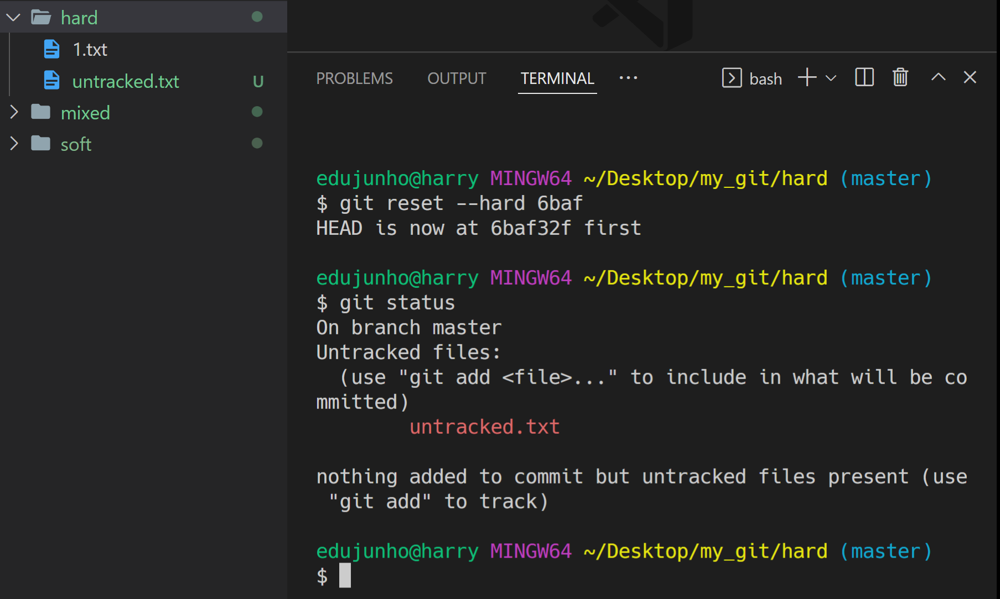

# Reset_Revert

> 공통점 : 과거로 되돌린다
>
> 차이점 : 과거로 되돌린다는 내용도 기록되는지(commit 이력에 남는지) 여부


## 1. git reset

- 업데이트를 했는데 예전 버전이 더 좋다고 느껴서 돌아가고 싶다면?
- `$ git reset [옵션] <커밋 ID>`
- 시간을 되돌려 과거로 돌아가는 듯한 행위로써, 특정 커밋 상태로 되돌아감
- 특정 커밋으로 되돌아 갔을 때, 해당 커밋 이후로 쌓아 놨던 커밋들은 전부 사라짐


#### 옵션

1. `--soft`
   - 돌아가려는 커밋으로 되돌아가고
   - 이후의 commit된 파일들을 `staging area`로 돌려놓음(commit 전 상태)
   - 즉, 다시 커밋할 수 있는 상태가 됨
2. `--mixed`
   - 돌아가려는 커밋으로 되돌아가고
   - 이후의 commit된 파일들을 `working directory`로 돌려놓음(add 전 상태)
   - 즉, unstage된 상태로 남아있음
   - 기본 값
3. `--hard`
   - 돌아가려는 커밋으로 되돌아가고
   - 이후의 commit된 파일들(Tracked 파일들)을 모두 working directory에서 삭제
   - Untracked 파일들은 그대로 Untracked 상태로 남음

- 비교

  - 시작 전

    ```bash
    $ git log --oneline
    20d320d (HEAD -> master) third
    1eb059e second
    6baf32f first
    ```

  - `--soft`

    ```bash
    $ git reset --soft 6baf
    ```

    

  - `--mixed`

    ```bash
    $ git reset 6baf
    ```

    

  - `--hard`
  
    ```bash
    $ git reset --hard 6baf
    ```
  
    

- 정리

  

- [참고사항]

  - 이미 삭제한 커밋으로 다시 돌아가고 싶다면? `git reflog` 사용

    - HEAD가 이전에 가리켰던 모든 커밋을 보여줌
    - `--hard` 옵션을 통해 지워진 커밋도 reglog로 조회하여 돌아갈 수 있다

    ```bash
    $ git reflog
    1a410ef HEAD@{0}: reset: moving to 1a410ef
    ab1afef HEAD@{1}: commit: modified repo.rb a bit
    484a592 HEAD@{2}: commit: added repo.rb
    
    $ git reset --hard <복구하고자 하는 커밋ID>
    ```


## 2. git revert

- `git reset`을 이용해 과거로 돌아간다면 쉽게 돌아갈 수 있지만, 커밋 내역이 사라지기 때문에 협업할 때 커밋 내역의 차이로 인해 충돌이 발생할 수 있다

  - 이러한 충돌을 방지하기 위한 명령어

- `$ git revert <커밋 ID>`

- 특정 사건을 없었던 일로 만드는 행위로써, 이전 커밋을 취소한다는 새로운 커밋을 만든다

- `git reset`은 커밋 내역을 삭제하는 반면, `git revert`는 새로 커밋을 쌓는다

- 예시

  - 시작 전 커밋

    ```bash
    $ git log --oneline
    20d320d third
    1eb059e second
    6baf32f first
    ```

  - second 커밋으로 revert

    ```bash
    $ git revert 1eb059
    ```

  - Vim 편집기가 나오면 저장 후 종료

    ```bash
    $ git log --oneline
    f0b5364 (HEAD -> master) Revert "second" # 새로 쌓인 커밋
    20d320d third
    1eb059e second # 히스토리는 남아있음
    6baf32f first
    ```

  - second 커밋에서 있었던 `2.txt`가 사라짐(second 커밋을 없었던 일로 만든것)

- [중요]

  - `git reset --hard 5sd2f42`라고 작성하면 5sd2f42라는 커밋`으로` 돌아간다는 뜻
  - `git revert 5sd2f42`라고 작성하면 5sd2f42라는 커밋`을` 되돌린다는 뜻

- [참고사항]

  ```bash
  # 공백을 통해 여러 커밋을 한꺼번에 되돌리기 가능
  $ git revert 7f6c24c 006dc87 3551584
  
  # 범위 지정을 통해 여러 커밋을 한꺼번에 되돌리기 가능
  $ git revert 3551584..7f6c24c
  
  # 커밋 메시지 작성을 위한 편집기를 열지 않음 (자동으로 커밋 완료)
  $ git revert --no-edit 7f6c24c
  
  # 자동으로 커밋하지 않고, Staging Area에만 올림 (이후, git commit으로 수동 커밋)
  # 이 옵션은 여러 커밋을 revert 할 때 하나의 커밋으로 묶는게 가능
  $ git revert --no-commit 7f6c24c
  ```