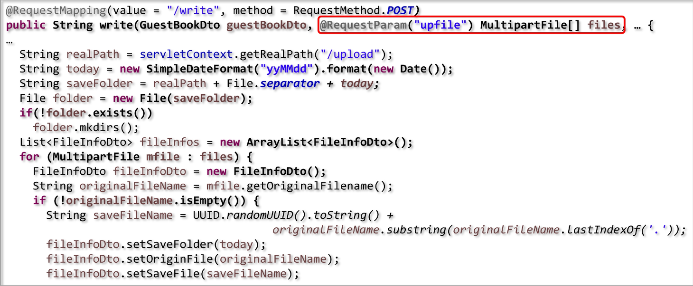

# FileUpload_Download

## File Upload

- pom.xml : commons-fileupload library 추가

  ```xml
  <dependency>
  	<groupId>commons-fileupload</groupId>
      <artifactId>commons-fileupload</artifactId>
      <version>1.3.3</version>
  </dependency>
  ```

- servlet-context.xml

- property

  - maxUploadSize : 최대 업로드 가능한 파일의 바이트 크기
  - maxInMemorySize : 디스크에 임시 파일을 생성하기 전에 메모리에 보관할 수 있는 최대 바이트 크기

  

- write.jsp : form 설정(file을 multiple로 받을 수 있게)

  

- GuestBookDto.java

  ```java
  public class GuestBookDto {
      
      private int articleno;
      private String userid;
      private String subject;
      private String content;
      private String regtime;
      private List<FileInfoDto> fileInfors; // 이 부분 추가
  }
  ```

- FileInfoDto.java

  ```java
  public class FileInfoDto {
      
      private String saveFolder; // 저장 폴더
      private String originFile; // 원본 파일
      private String saveFile; // 실제 저장 파일
  }
  ```

- GuestBookController.java

  

  - String 세줄
    - 첫 줄에서 업로드
    - 둘째 줄에서 오늘 날짜로 이름 만들고
    - 셋째 줄에 업로드 + 파일 구분자 + 파일 이름

  

  -  실제 저장폴더(folder)에 saveFileName이라는 이름으로 전송

- GuestBookServiceImpl.java

  

  - Transactional

- guestbook.xml

  

  

  


## File Download

- list.jsp

  

- servlet-context.xml

  

- GuestBookController.java

  

- FileDownLoadView.java

  


## Interceptor

- HandlerInterceptor를 통한 요청 가로채기
  - Controller가 요청을 처리하기 전/후 처리
  - 로깅, 모니터링 정보 수집, 접근 제어 처리 등의 실제 Business Logic과는 분리되어 처리해야 하는 기능들을 넣고 싶을 때 유용함
  - interceptor를 여러개 설정할 수 있음(순서주의)
- HandlerInterceptor method
  - boolean preHandle(HttpServletRequest request, HttpServiceResponse response, Object handler)
    - false를 반환하면 request를 바로 종료
  - void postHandle(HttpServletRequest request, HttpServletResponse response, Object handler, ModelAndView modelAndView)
    - Controller 수행 후 호출
  - void afterCompletion(HttpServletRequest request, HttpServletResponse response, Object handler, Exception ex)
    - view를 통해 클라ㅇ언트에 응답을 전송한 뒤 실행
    - 예외가 발생하여도 실행