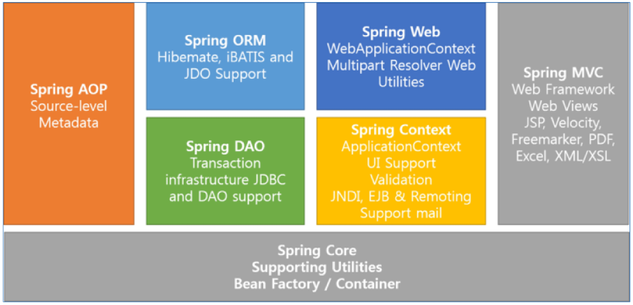

# SpringArchitectureDI


## Framework의 개념

#### 기존 Controller

- 사용자의 요청에 따라 판단(act)
- method 이용해 사용자가 보내온 data 얻어와 Dto에 받기(request.getParameter())
  - id, 비밀번호 등 받기 위해 쓰는 느낌
  - business logic을 call해서 어디로 가야하는지 return
- return된 경로에서 redirect/forward 이용해 해당 경로로 이동시켜서 redirect/forward
  - 그 중에선 forward를 많이 씀
- controller 하나 만들어놓고 if문에 따라 기능을 돌리기 vs controller 여러개 만들기(로그인용, 게시물용 이런식)


#### DI(Dependency Injection)

- controller는 service 없이 못살고 service는 Dao없이 못살며 Dao는 Data Source없이 못산다
- singleton을 개발자가 만들 필요가 없음
- Dao를 얻어오라는 명령을 할 필요가 없음
  - 변수 하나 선언해놓고 쓰기만 하면 됨!
- 기존 controller에서 하던 모든게 자동으로 바뀐다!
  - 하지만 자동에는 설정이 따른다
- html방식과 annotation 방식이 있는데 요즘은 거의 annotation 방식
  - annotation :  클래스와 메서드에 추가하여 다양한 기능을 부여하는 역할


## Spring Framework 개요 및 개발환경 설정

#### SpringFramework 등장배경

- EJB를 사용하면 앱 작성을 쉽게 할 수 있다
- 개발 시 Low Level의 트랜잭션이나 상태관리, 멀티 쓰레딩, 리소스 풀링등 복잡한 Low Level의 API 이해를 생략 가능
- EJB 현실적인 반영
  - 코드 수정 후 반영하는 과정 자체가 거창해 기능은 좋지만 복잡한 스펙으로 인한 개발 효율성 떨어짐
  - 앱 테스트 위해 반드시 EJB 서버 필요
- 웹사이트가 점점 커지면서 엔터프라이즈급의 서비스 필요
- 자바진영에서는 EJB가 엔터프라이즈급 서비스로 각광을 받음
- EJB 사용 없이 엔터프라이즈 앱 개발 방법이 소개됨(스프링의 모태)
- 점차 POJO+경량 프레임워크 사용 시작(그중하나가 Spring)
  - POJO
    - 특정 프레임워크나 기술에 의존적이지 않은 자바 객체
    - 특정 기술에 종속적이지 않기 때문에 생산성, 이식성 향상
    - Plain : component interface를 상속받지 않는 특징
    - old : EJB 이전의 Java class
  - POJO+framework
    - EJB 같은 거창한 컨테이너 필요 X
    - 오픈소스 프레임워크(무료)
    - 각종 기업용 앱 개발에 필요한 많은 라이브러리 지원
    - 스프링 프레임워크는 모든 플랫폼에서 사용 가능
    - 스프링은 웹 분야 뿐만 아니라 앱 등 모든 분야에 적용 가능한 다양한 라이브러리를 가짐


#### Spring Framework

- 자바로 Enterprise Application을 만들 때 포괄적으로 사용하는 programming 및 configuration model을 제공해주는 framework로 application 수준의 인프라 스트럭쳐 제공
- 개발자가 복잡하고 실수하기 쉬운 low level에 신경 쓰지 않고 개발에 전념 가능
- Spring 삼각형 : Enterprise Application 개발 시 복잡함을 해결하는 Spring 핵심
  - POJO(Plain Old Java Object)
    - 특정 환경이나 기술에 종속적이지 않은 객체지향 원리에 충실한 자바객체
    - 테스트하기 용이하며, 객체지향 설계를 자유롭게 적용할 수 있다
  - PSA(Portable Service Abstraction)
    - 환경과 세부기술의 변경과 관계없이 일관된 방식으로 기술에 접근할 수 있게 해주는 설계 원칙
    - 기술적 복잡함은 추상화를 통해 Low Level 기술 구현 부분과 기술 사용하는 인터페이스로 분리
    - 예를 들어 데이터베이스에 관계없이 동일하게 적용할 수 있는 트랜잭션 처리방식
  - IoC/DI(Dependency Injection)
    - DI는 유연하게 확장 가능한 객체를 만들어 두고 객체 간의 의존관계는 외부에서 다이나믹하게 설정
  - AOP(Aspect Oriented Programming)
    - 관심사의 분리를 통해서 소프트웨어의 모듈성 향상
    - 공통 모듈을 여러 코드에 쉽게 적용가능


#### Spring Framework module



- Spring Core
  - Spring Framework의 핵심 기능을 제공하며, Core 컨테이너의 주요 컴포넌트는 Bean Factory
- Spring Context
  - Spring을 컨테이너로 
- Spring AOP
- Spring DAO
- Spring DAO
- Spring ORM
- Spring Web
- Spring Web MVC


## Ioc & Container

- Ioc(Inversion of Control, 제어의 역행)
  - IoC/DI
  - 객체지향 언어에서 Object간의 연결 관계를 런타임에 결정
  - 객체 간의 관계가 느슨하게 연결됨(loose coupling)
  - IoC 구현 방법 중 하나가 DI
- IoC 유형
  - Dependency Lookup
    - 컨테이너가 lookup context를 통해 필요한 Resource나 Object를 얻는 방식
    - JNDI 이외의 방법을 사용한다면 JNDI 관련 코드를 오브젝트 내에서 일일이 변경해주어야 함
    - Lookup한 Object를 필요한 타입으로 Casting 해 주어야 함
    - Naming Exception을 처리하기 위한 로직 필요
  - Dependency Injection
    - Object에 lookup 코드를 사용하지 않고 컨테이너가 직접 의존 구조를 Object에 설정할 수 있도록 지정해주는 방식
    - Object가 컨테이너의 존재 여부를 알 필요가 없음
    - Lookup 관련 코드들이 Object 내에서 사라짐
    - Setter Injection과 Constructor Inject
- Container
  - 객체의 생성, 사용, 소멸에 해당하는 라이프사이클 담당
  - 라이프사이클을 기본으로 애플리케이션 사용에 필요한 주요 기능 제공
- Container 기능
  - 라이플 사이클 관리
  - Dependency 객체 제공
  - Thread 관리
  - 기타 애플리케이션 실행에 필요한 환경
- Container 필요성
  - 비즈니스 로직 외에 부가적인 기능들에 대해서는 독립적으로 관리되도록 하기 위함
  - 서비스 lookup이나 Configuration에 대한 일관성 갖기 위함
  - 서비스 객체를 사용하기 위해 각각 Factory 또는 Singleton 패턴을 직접 구현하지 않아도 됨
- IoC Container
  - 오브젝트의 생성과 관계설정, 사용, 제거 등의 작업을 애플리케이션 코드 대신 독립된 컨테이너가 담당
  - 컨테이너가 코드 대신 오브젝트에 대한 제어권을 갖고 있어 IoC라고 부름
  - 이런 이유로 스프링 컨테이너를 IoC 컨테이너라고 부르기도 함
  - 스프링에서 IoC를 담당하는 컨테이너에는 BeanFactory, ApplicationContext가 있음
- Spring DI Container
  - Bean Factory : Spring DI Container가 관리하는 객체를 빈(Bean)이라고 하고, 이 빈들의 생명주기를 관리하는 의미로 빈팩토리라고 한다
    - Bean을 등록, 생성, 조회, 반환 관리
    - 일반적으로 BeanFactory보다 이를 확장한 ApplicationContext 사용
    - getBean() method가 정의되어 있음
  - Bean Factory에 여러 가지 컨테이너 기능을 추가하여 ApplicationContext라 한다
- IoC 개념
  - 객체 제어 방식
    - 기존 : 필요한 위치에서 개발자가 필요한 객체 생성 로직 구현
    - IoC : 객체 생성을 Container에게 위임하여 처리
  - IoC 사용에 따른 장점
    - 객체 간의 결합도를 떨어뜨릴 수 있음(loose coupling)
  - 객체간 결합도가 높으면?
    - 해당 클래스가 유지보수 될 때 그 클래스와 결합된 다른 클래스도 같이 유지보수 되어야 할 가능 성이 높음
  - 객체간 강한 결합
    - 클래스 호출 방식
    - 클래스내 선언과 구현이 모두 되어 있어 다양한 형태로 변화 불가능
    - MemberService 구현체와 AdminService 구현체를 HomeController에서 직접 생성하여 사용
    - MemberService 또는 AdminService가 교체되거나 내부 코드가 변경되면 HomeController까지 수정해야할 가능성이 있음
  - 객체간 강한 결합을 다형성을 통해 결합도를 낮춤
    - 인터페이스 호출 방식
    - 구현 클래스 교체가 용이하며 다양한 형태로 변화가능
    - 하지만 인터페이스 교체 시 호출 클래스도 수정해야 함
    - MemberService와 AdminService는 CommonService를 상속
    - HomeController에서 각 서비스 이용 시 MemberService와 AdminService는 CommonService Type으로 사용 가능
  - 객체 간의 강한 결합을 Factory를 통해 결합도를 낮춤
    - 팩토리 호출 방식
    - 팩토리가 구현 클래스를 생성하므로 클래스는 팩토리 호출
    - 인터페이스 변경시 팩토리만 수정하면 됨. 호출 클래스에는 영향 X
    - 하지만 클래스에 팩토리를 호출하는 소스가 들어가야 함. 그것 자체가 팩토리에 의존함을 의미한다
    - 각 서비스를 생성하여 반환하는 Factory 사용
    - Service를 이용하는 쪽에서는 Interface만 알고 있으면 어떤 구현체가 어떻게 생성되는지 알 필요 없음
    - Factory 패턴이 적용된 것이 Container의 기능이며 이 Container의 기능을 제공해 주고자 하는 것이 IoC모듈
    - **di1에서 di3로 바꾼 케이스!**
      - Factory를 써서 결합도를 낮췄음
  - 객체 간의 강한 결합을 Assembler를 통해 결합도를 낮춤
    - IoC 호출 방식
    - 팩토리 패턴의 장점을 더하여 어떠한 것에도 의존하지 않는 형태가 됨
    - 실행시점에 클래스 간의 관계가 형성됨
    - 각 서비스의 LifeCycle을 관리하는 Assembler를 사용
    - Spring Container가 Assembler 역할을 함


## DI(Dependency Injection)

#### 빈 생성범위

- 싱글톤 빈

  - 스프링 빈은 기본적으로 싱글톤으로 만들어짐
  - 따라서 컨테이너가 제공하는 모든 빈의 인스턴스는 항상 동일
  - 컨테이너가 항상 새로운 인스턴스를 반환하게 만들고 싶은 경우 scope를 prototype으로 설정
  - 범위 지정
    - singleton : 스프링 컨테이너당 하나의 인스턴스 빈만 생ㅅ어
    - prototype : 컨테이너에 빈을 요청할 때마다 새로운 인스턴스 생성
    - request : HTTP Request별로 새로운 인스턴스 생성
    - session : HTTP Session별로 새로운 인스턴스 생성

- 스프링 빈 설정 : Annotation

  - Annotation

    - 애플리케이션 규모가 커지고 빈의 개수가 많아질 경우 XML 파일을 관리하는 것이 번거로움

    - 빈으로 사용될 클래스에 특별한 annotation을 부여해 주면 자동으로 빈 등록 가능

    - 오브젝트 빈 스캐너로 빈 스캐닝을 통해 자동 등록

      - 빈 스캐넌는 기본적으로 클래스 이름을 빈의 아이디로 사용
      - 정확히는 클래스 이름의 첫 글자만 소문자로 바꾼 것을 사용

      ```java
      @Component
      public class MemberServiceImpl implements MemberService {
          @Autowired
          private MemberDao memberDao;
          
          @Override
          public int registerMember(MemberDto memberDto) {
              return MemberDao.registerMember(memberDto);
          }
      }
      ```

    - 앞으로 XML파일 건드리는게 아니라 이 @Autowired 쓸 예정

  - Annotation으로 빈을 설정할 경우 반드시 component-scan을 설정해야 한다

    - <context:component-scan base-package="com.test.hello.*"/>

  - Stereotype

    - @Respository

      - Data Access Layer의 DAO 또는 Repository 클래스에 사용, DataAccessException 자동변환과 같은 AOP 적용 대상을 선정하기 위해 사용

    - @Service

      - Service Layer 클래스에 사용

    - @Controller

      - Presentation Layer의 MVC Controller에 사용. 스프링 웹 서블릿에 의해 웹 요청을 처리하는 컨트롤러 빈으로 선정

    - @Component

      위의 Layer 구분을 적용하기 어려운 일반적인 경우에 설정


#### DI - XML

- XML 문서 이용
  - Application에서 사용할 Spring 자원들을 설정하는 파일
  - Spring Contatiner는 설정파일에서 설정된 내용을 읽어 Application에서 필요한 기능들을 제공
  - Root tag는 `<beans>`
  - 파일명은 상관X
- 기본 설정 - 빈 객체 생성 및 주입
  - 주입할 객체를 설정파일에 설정
    - bean : 스프링 컨테이너가 관리할 Bean객체 설정
  - 기본 속성
    - name : 주입받을 곳에서 호출할 이름 설정
    - id : 주입받을 곳에서 호출할 이름 설정(유일값)
    - class : 주입할 객체의 클래스
    - factory-method : Singleton 패턴으로 작성된 객체의 factory 메소드 호출
    - init-method : 초기화시켜줄 메소드를 직접 호출. 그나마 가장 쓸만함


#### 스프링 빈 의존 관계 설정 - XML

> 거의 annotation만 쓰고 이건 옛날 방식이라 잘 안쓰지만 알아두긴 해야함 ~나중에 공부

- Constructor 이용
- Property 이용
  - 주의점
    - 하나의 Property에 하나의 값만 세팅할 수 있다
    - 객체 이용시 reference 사용
    - p라는 namespace


## Annotation

- annotation : 멤버 변수에 직접 정의하는 경우 setter method를 만들지 않아도 됨
  - **@Autowired**
    - Spring Framework에서 지원하는 Dependency 정의 용도의 annotation으로,  Spring Framework에 종속적이긴 하지만 정밀한 Dependency Injection이 필요한 경우 유용하다
    - 많이 쓰임


## 실습

- ctrl+space : 자동완성
- ctrl+shift+s => r : getter/setter 만들기
  - getter-받는애 setter-주는애
- url에서 `&` 대신 `&amp;` 쓰기
- 세가지 방식
  - xml
    - datasource에서 driverClass, url, username, password name으로 하는 property를 가진 bean 만들기
    - bean을 만들어서 id를 gbService라고 지정, gbDao 지정
    - serviceImpl에서 setter 지정, daoimpl에서 setter 지정
    - main에서 해당 id로 getBean을 한다

  - annotate
    - driverClass, url, username, password 넣어줬던 bean은 그대로 가져오자
      - (com.ssafy.model 스캔하는 내용에 그 내용이 없으니까)

    - context:component-scan을 해서 ~패키지 안에 있는거를 스캔해라
    - DaoImpl의 public class 위에 @Repository 달려있음
    - serviceimpl에서 public class 위에 @Service("getBean")를 달아준다
      - 그럼 Dao를 못찾는 오류 -=> GuestBookDao에 @Autowired를 달아줌
        - (@Autowired 하면 setter 지정 안해도됨)
        - 그래도 오류 => GuestBookDaoImpl에도 dataSource에 @Autowired 달아주기

  - javaconfig
    - ApplicationContext를 XML에서 얻어와라 했었는데
      - XML을 대신할 수 있는 Java 파일을 만들음(Configuration)

    - new AnnotationConfigApplicationContext(ApplicationConfig.class)
      - 를 설정파일로 쓸거야!

    - Applicationconfig.java에서 public class 위에 @Configuration 달아주기
      - 이건 설정을 하는 Class야! 라는 뜻

    - 밑에 있는 datasource에 @Bean 달아주기
      - 얘는 Bean이야 라는걸 알려주는거

    - @Configuration 밑에 @ComponentScan(basePackages = {"com.ssafy.model"})
      - 컴포넌트스캔도 할거야! 라는 뜻
      - 딴것도 쓸거라면 @ComponentScan(basePackages = {"com.ssafy.model", "com.ssafy.controller"}) 이런식으로

