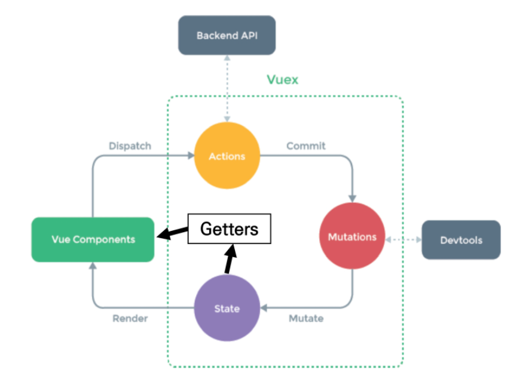

# Vuex

> 상태를 전역 저장소로 관리할 수 있도록 지원하는 라이브러리

- 상태 관리 패턴 + 라이브러리
  - 상태 관리 패턴 : 컴포넌트의 공유된 상태를 추출하고 이를 전역에서 관리하도록 함
- 모든 컴포넌트에 대한 중앙 집중식 저장소
- State
  - state는 곧 data이며 해당 애플리케이션의 핵심이 되는 요소
  - 중앙에서 관리하는 모든 상태 정보
- 기존 단방향 흐름에 의존한 Pass props & Emit event 방식과 다르게 중앙 저장소(store)에 state를 모아놓고 관리
- 규모가 큰 프로젝트에서 효율적인 방식 


## Vuex Core Concepts

> State, Mutations, Actions, Getters



- State
  - 중앙에서 관리하는 모든 상태 정보(data)
  - 이 단일 객체는 모든 애플리케이션 상태를 포함하는 "원본 소스" 역할을 한다
  - 여러 컴포넌트 내부에 있는 특정 state를 중앙에서 관리하게 됨(이전에는 각 컴포넌트 직접 확인)
  - 컴포넌트는 Vuex store에서 state 정보 가져와 사용
- Mutations
  - **실제로 state를 변경하는 유일한 방법**
  - mutation의 handler는 반드시 동기적이어야 함
  - 첫번째 인자로 항상 state를 받음
  - Actions에서 commit() 메서드에 의해 호출됨
  - Actions => (commit) => Mutations => (mutate) => State
- Actions
  - Mutations와 유사하지만 state를 변경하는 대신 mutations를 commit() 메서드로 호출해서 실행
  - 비동기 작업이 포함될 수 있음
  - **context 객체 인자**를 받음 => state 변경은 X
  - 컴포넌트에서 dispatch() 메서드에 의해 호출됨
  - Actions를 통해 state를 조작할 수 있지만 명확한 역할 분담을 위해 Mutations를 통해서만 조작해야 함
  - 컴포넌트 => (dispatch) => Actions => (commit) => Mutations
- Getters
  - state를 변경하지 않고 활용하여 계산을 수행
  - 사실상 computed 속성과 유사
  - compute처럼 state를 기준으로 계산
  - getters의 결과는 state 종속성에 따라 캐시(cached)되고, 종속성이 변경된 경우에만 재계산됨
  - getters 자체가 state를 변경하지는 않음
  - state => Getters => 컴포넌트


## practice - Todo App 만들기

#### 1. Init project

```bash
$ vue create todo-vuex-app
$ cd todo-vuex-app
$ vue add vuex
Yes
```

- vuex로 인한 변화

  - store 디렉토리 생성

  - store/index.js 생성 : Vuex core concepts가 작성 되는 곳

    ```js
    import Vue from 'vue'
    import Vuex from 'vuex'
    
    Vue.use(Vuex)
    
    export default new Vuex.Store({
      state: {  // data
      },
      mutations: {  
      },
      actions: {  
      },
      modules: {  
      }
    })
    ```


#### 2. 컴포넌트 작성

- TodoListItem.vue

  - 개별 todo 컴포넌트

  - TodoList 컴포넌트의 자식 컴포넌트

    ```vue
    <!-- components/TodoListItem.vue -->
    
    <template>
      <div>Todo</div>
    </template>
    
    <script>
    export default {
      name: 'TodoListItem',
    }
    </script>
    ```

- TodoList.vue

  - todo 목록 컴포넌트

  - TodoListItem 컴포넌트의 부모 컴포넌트

    ```vue
    <!-- components/TodoList.vue -->
    
    <template>
      <div>
        <todo-list-item></todo-list-item>
      </div>
    </template>
    
    <script>
    import TodoListItem from '@/components/TodoListItem'
    // import TodoListItem from './TodoListItem.vue'
    
    export default {
      name: 'TodoList',
      components: {
        TodoListItem,
      }
    }
    </script>
    ```

- TodoForm.vue

  - todo 데이터를 입력 받는 컴포넌트

    ```vue
    <!-- components/TodoForm.vue -->
    
    <template>
      <div>Todo Form</div>
    </template>
    
    <script>
    export default {
      name: 'TodoForm',
    }
    </script>
    ```

- App.vue

  - 최상위 컴포넌트

  - TodoList, TodoForm의 부모 컴포넌트

    ```vue
    <!-- App.vue -->
    
    <template>
      <div id="app">
        <h1>Todo List</h1>
        <todo-list></todo-list>
        <todo-form></todo-form>
      </div>
    </template>
    
    <script>
    import TodoList from '@/components/TodoList'
    import TodoForm from '@/components/TodoForm'
    
    export default {
      name: 'App',
      components: {
        TodoList,
        TodoForm,
      }
    }
    </script>
    ```
    
    

#### 3. Create Todo

- State 작성

  - state에 2개의 todo 임시로 작성

    ```js
    // index.js
    
      state: {
        todos: [
          {
            title: '할 일1',
            isCompleted: false,
            date: new Date().getTime(),
          },
          {
            title: '할 일2',
            isCompleted: false,
            date: new Date().getTime() + 1,
          }
        ]
      },
    ```

- TodoList 데이터 가져오기

  - 컴포넌트에서 Vuex Store의 state에 접근

    ```vue
    <!-- components/TodoList.vue -->
    
    <template>
      <div>
        <todo-list-item
        v-for="todo in $store.state.todos"
        :key="todo.date"
        >
        </todo-list-item>
      </div>
    </template>
    ```

- Computed로 변경

  - 현재 state의 todo는 값이 변화하는 것이 아님
  - store에 저장된 todo 목록을 가져오는 것이기 때문에 매번 새로 호출하는 것은 비효율적
  - 대신 todo가 추가되는 등의 변경 사항이 있을 때만 새로 계산한 값을 반환하는 방향으로 변경(computed)
  - 이걸 data로 써버릴 경우 data(==state)는 오직 mutation으로만 바꾸기로 했는데 그 흐름이 망가져버림

  ```vue
  <!-- components/TodoList.vue -->
  
  <script>
  export default {
    name: 'TodoList',
    components: {
      TodoListItem,
    },
    computed: {
      todos() {
        return this.$store.state.todos
      }
    } // 이 부분
  }
  </script>
  ```

- todo라는 props로 todo를 Pass해주기!

  ```vue
  <!-- components/TodoList.vue -->
  
  <template>
    <div>
      <todo-list-item
      v-for="todo in todos"
      :key="todo.date"
      :todo="todo"
      > <!-- todo 추가해서 넘겨 주기 -->
      </todo-list-item>
    </div>
  </template>
  ```

  ```vue
  <!-- components/TodoListItem.vue -->
  
  <template>
    <div>{{ todo.title }}</div> <!-- 변경 1 -->
  </template>
  
  <script>
  export default {
    name: 'TodoListItem',
    props: {
      todo: {
        type: Object,
      } // 변경 2
    }
  }
  </script>
  ```

- Actions & Mutations

  - Actions : createTodo 함수를 통해 CREATE_TODO 함수를 호출

  - Mutations : CREATE_TODO 함수를 통해 State의 todo 데이터 조작

    ```js
    // index.js
    
    export default new Vuex.Store({
      state: {
          todos: [],
      }
      mutations: {
        CREATE_TODO(state, newTodo) {
          state.todos.push(newTodo)
        },
      },
      actions: {
        createTodo(context, newTodo) {
          context.commit('CREATE_TODO', newTodo)
        },
      },
      ...
    })
    ```

  - dispatch() : createTodo 메서드를 통해 createTodo Action 함수 호출

    ```vue
    <!-- components/TodoForm.vue -->
    
    <template>
      <div>
        Todo FORM
        <input type="text" 
          v-model.trim="todoTitle"
          @keyup.enter="createTodo"
        > <!-- 1, 2 -->
      </div>
    </template>
    
    <script>
    
    export default {
      name: 'TodoForm',
      data() {
        return {
          todoTitle: ''
        }
      }, <!-- 2. v-model(사용자 입력에 가장 좋은 방법)을 다루기 위한 data -->
      methods: {
        createTodo() {
          const newTodo = {
            title: this.todoTitle,
            isCompleted: false,
            date: new Date().getTime()
          } <!-- 1. @keyup.enter가 발생하면 생길 newTodo를 만들어 내는 함수 createTodo -->
          this.$store.dispatch('createTodo', newTodo) <!-- 3. dispatch -->
          this.todoTitle = '' <!-- 4. 입력창 초기화 -->
        }
      }
    }
    </script>
    ```

- JavaScript Destructuring assignment

  - 배열의 값이나 객체의 속성을 고유한 변수로 unpack할 수 있는 JS 표현식

  ```js
  // index.js
  
  export default new Vuex.Store({
    state: {
        todos: [],
    }
    mutations: {
      CREATE_TODO(state, newTodo) {
        state.todos.push(newTodo)
      },
    },
    // actions: {
    //   createTodo(context, newTodo) {
    //     context.commit('CREATE_TODO', newTodo)
    //   },
    // },
    actions: {
      createTodo({ commit }, newTodo) {
        commit('CREATE_TODO', newTodo)
      },
    },
    ...
  })
  ```


#### 4. Delete Todo

- deleteTodo action 함수 호출

  ```vue
  <!-- components/TodoListItem.vue -->
  
  <template>
    <div>
      {{ todo.title }}
      <button @click="deleteTodo">X</button>
    </div>
  </template>
  
  <script>
  export default {
    name: 'TodoListItem',
    props: {
      todo: {
        type: Object,
      }
    },
    methods: {
      deleteTodo() {
        this.$store.dispatch('deleteTodo', this.todo)
      } // deleteTodo
    }
  }
  </script>
  ```

- Action & Mutations

  ```js
  // index.js
  
  actions: {
    ...,
    deleteTodo({ commit }, todoItem) {
      commit('DELETE_TODO', todoItem)
    } // 0. deleteTodo 함수를 통해 DELETE_TODO 함수를 호출
  },
  
  mutations: {
    ...,
    DELETE_TODO(state, todoItem) {
      // 1. todoItem이 첫 번째로 만나는 요소의 index를 가져옴
      const index = state.todos.indexOf(todoItem)
      // 2. 해당 index 1개만 삭제하고 나머지 요소를 토대로 새로운 배열 생성
      state.todos.splice(index, 1)
    },
  },
  ```


#### 5. Update Todo

- updateTodoStatus action 함수 호출

  ```vue
  <!-- components/TodoListItem.vue -->
  
  <template>
    <div>
      <span @click="updateTodoStatus">{{ todo.title }}</span> <!-- 제목 클릭 시 수정-->
      <button @click="deleteTodo">X</button>
    </div>
  </template>
  
  <script>
  export default {
    name: 'TodoListItem',
    props: {
      todo: {
        type: Object,
      }
    },
    methods: {
      deleteTodo() {
        this.$store.dispatch('deleteTodo', this.todo)
      },
      updateTodoStatus() {
        this.$store.dispatch('updateTodoStatus', this.todo)
      } // updateTodoStatus
    }
  }
  </script>
  ```

- Action & Mutations

  ```js
  // index.js
  
  actions: {
    ...,
    updateTodoStatus({ commit}, todoItem) {
      commit('UPDATE_TODO_STATUS', todoItem)
    } // 0. udpateTodoStatus 함수를 통해 UPDATE_TODO_STATUS 함수를 호출
  },
  
  mutations: {
    ...,
    UPDATE_TODO_STATUS(state, todoItem) {
      // 4. 배열의 각 요소에 함수가 적용된 새로운 배열을 state.todos에 할당
      state.todos = state.todos.map(todo => {
        // 1. 선택된 todoItem과 현재 todos의 요소 todo가 서로 일치하면,
        if (todo === todoItem) {
          // 2. isCompleted의 값을 변경
          todo.isCompleted = !todo.isCompleted
        }
        // 3. 배열 return
        return todo
      })
    }
  },
  ```

- JavaScript Spread Syntax

  - 배열이나 문자열 같이 반복 가능한 문자를 요소로 확장하여, 0개 이상의 key-value 쌍으로 된 객체로 확장이 가능

  ```js
  // index.js
  
  // 원래 기본 구조의 mutation
  if (todo === todoItem) {
      return {
          title: todoItem.title,
          date: new Date().getTime(),
          isCompleted: !todo.isCompleted
      }
  } else {
      return todo
  }
  
  // JSSS 사용 - 교수님 버전(위에 적은 버전)
  if (todo === todoItem) {
      todo.isCompleted = !todo.isCompleted
  }
  
  // JSSS 사용 - 다른 방법
  if (todo === todoItem) {
      ...todo
      isCompleted: !todo.isCompleted
  }
  ```

- 취소선 긋기

  - v-bind를 사용한 class binding

    ```vue
    <!-- components/TodoListItem.vue -->
    
    <template>
      <div>
        <span
        @click="updateTodoStatus"
        :class="{ 'is-completed': todo.isCompleted }"
        > <!-- class binding -->
        {{ todo.title }}
        </span>
        <button @click="deleteTodo">X</button>
      </div>
    </template>
    
    ...
    
    <style>
    .is-completed {
      text-decoration: line-through;
    }  /* css 추가 */
    </style>
    ```


#### 6. Getters 정의 및 활용

- 전체 todo 개수, 완료된 todo 개수, 완료되지 않은 todo 개수 계산

  ```js
  // index.js
  
  getters: {
    allTodosCount(state) {
      return state.todos.length
    },
    completedTodosCount(state) {
      return state.todos.filter(todo => {
        return todo.isCompleted // (=== true와 같은 동작)
      }).length
    },
    uncompletedTodosCount(state) {
      return state.todos.filter(todo => {
        return !todo.isCompleted
      }).length
    },
  },
  ```
  
- 계산된 값 출력

  ```vue
  <!-- app.vue -->
  
  <template>
    <div id="app">
      <h1>Todo List</h1>
      <h2>전체 : {{ $store.getters.allTodosCount }}</h2>
      <h2>끝난거 : {{ $store.getters.completedTodosCount }}</h2>
      <h2>남은거 : {{ $store.getters.uncompletedTodosCount }}</h2>
      <todo-list></todo-list>
      <todo-form></todo-form>
    </div>
  </template>
  ```

- 이렇게만 해줘도 작동은 하지만 계산하여 computed 반환 값으로 사용하는 것이 더 일반적임

  - 이를 위해서

    ```js
    <!-- app.vue -->
    
    export default {
        computed: {
        	completedTodoCount() {
                return this.$store.getters.completedTodoCount
            }
            ...
        }
    }
    ```

  - 이렇게 써줘도 되지만 index.js의 getters를 그대로 활용하는 방법도 있다.

    ```vue
    <!-- app.vue -->
    <template>
      <div id="app">
        <h1>Todo List</h1>
        <h2>전체 : {{ allTodosCount }}</h2>
        <h2>끝난거 : {{ completedTodosCount }}</h2>
        <h2>남은거 : {{ uncompletedTodosCount }}</h2> <!-- 3. 이름 그대로 사용 -->
        <todo-list></todo-list>
        <todo-form></todo-form>
      </div>
    </template>
    
    <script>
    import TodoList from '@/components/TodoList'
    import TodoForm from '@/components/TodoForm'
    import { mapGetters } from 'vuex' // 1. { mapGetters } import하기
    
    export default {
      name: 'App',
      components: {
        TodoList,
        TodoForm,
      },
      computed: {
        ...mapGetters([
          'allTodosCount',
          'completedTodosCount',
          'uncompletedTodosCount',
        ]) // 2. 활용
      },
    }
    </script>
    ```


#### 7. Component Binding Helper

- mapState

  - computer Store의 state를 매핑

  - 매핑된 computed 이름이 state 이름과 같을 때 문자열 배열을 전달할 수 있음

    ```vue
    <!-- components/TodoList.vue -->
    
    <script>
    import TodoListItem from '@/components/TodoListItem.vue'
    
    import { mapState } from 'vuex' // 1.
    
    export default {
      name: 'TodoList',
      components: {
        TodoListItem
      },
      computed: {
        ...mapState(['todos']), // 2.
        // todos() {
        //   return this.$store.state.todos
        // }
      },
    
    }
    </script>
    ```

- mapGetters

  - 위에서 사용한 방법
  - Computed와 Getters를 매핑

- mapActions

  - action을 전달하는 컴포넌트 method 옵션을 만듦

  - actions를 객체 전개 연산자로 계산하여 추가하기

    ```vue
    
    <template>
      <div>
        <!-- 특수 문법 deleteTodo 실행할 때, todo 같이 넘겨주셔야 함! -->
        <span 
          @click="updateTodoStatus(todo)"
          :class="{'is-completed': todo.isCompleted}"  
        >
          {{ todo.title }}
        </span>
        <button @click="deleteTodo(todo)">[x]</button>
      </div>
    <!-- 3. span과 button속 deleteTodo/updatedTodoStatus 메소드가 (todo)를 받도록 변경-->
    </template>
    
    <script>
    import { mapActions } from 'vuex' // 1.
    
    export default {
      name: 'TodoListItem',
      props: {
        todo: Object,
      },
      methods: {
        ...mapActions(['deleteTodo', 'updateTodoStatus']) // 2.
      }
    }
    </script>
    ```


#### 8. LocalStorage

- Vuex state를 자동으로 브라우저의 LocalStorage에 저장해주는 라이브러리 중 하나

- 페이지가 새로고침 되어도 Vuex state를 유지시키는 것이 목표

- 방법

  1. 설치

     ```bash
     $ npm i vuex-persistedstate
     ```

  2. 라이브러리 사용

     ```js
     // index.js
     
     import createPersistedState from 'vuex-persistedstate'
     
     export default new Vuex.Store({
       plugins: [
         createPersistedState()
       ],
       ...
     })
     ```

  3. 개발자도구 - Application - Local Storage에서 저장된 데이터 확인 가능
