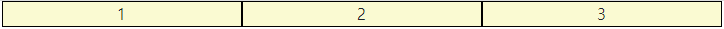
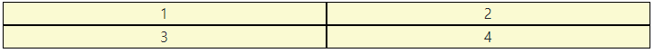
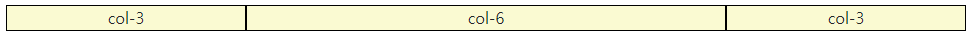
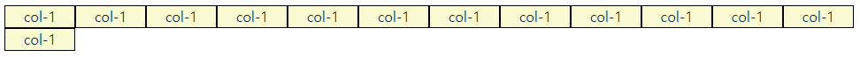
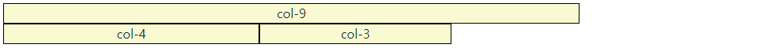
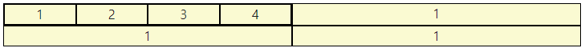
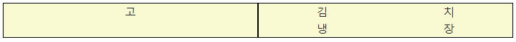

# Bootstrap

> the world most popular front-end open source

- [링크](https://getbootstrap.com/)에서 Components 등 확인 가능


- 사용법

```html
<title>Document</title>
    <link href="https://cdn.jsdelivr.net/npm/bootstrap@5.1.3/dist/css/bootstrap.min.css" rel="stylesheet" integrity="sha384-1BmE4kWBq78iYhFldvKuhfTAU6auU8tT94WrHftjDbrCEXSU1oBoqyl2QvZ6jIW3" crossorigin="anonymous">
</head>

<body>
  
  ...

  <script src="https://cdn.jsdelivr.net/npm/bootstrap@5.1.3/dist/js/bootstrap.bundle.min.js" integrity="sha384-ka7Sk0Gln4gmtz2MlQnikT1wXgYsOg+OMhuP+IlRH9sENBO0LRn5q+8nbTov4+1p" crossorigin="anonymous"></script>

</body>
```


## Spacing

| class | 의미    |
| ----- | ------- |
| m     | margin  |
| p     | padding |


| class | 의미        |
| ----- | ----------- |
| t     | top         |
| b     | bottom      |
| s     | left        |
| e     | right       |
| x     | left, right |
| y     | top, bottom |


| class | rem  | px   |
| ----- | ---- | ---- |
| 0     | 0    | 0    |
| 1     | 0.25 | 4    |
| 2     | 0.5  | 8    |
| 3     | 1    | 16   |
| 4     | 1.5  | 24   |
| 5     | 3    | 48   |


- example

```css
.mt-1 {
    margin-top: 0.25rem !important;
}
```

```css
.mx-auto {
    margin-right: auto !important;
    margin-left: auto !important;
}
```


## Color

```css
:root {
    --primary: #007bff; /* 파랑 */
    --secondary: #6c757d; /* 옅은 회색 */
    --success: #28a745; /* 초록 */
    --info: #17a2b8; /* 하늘 */
    --warning: #ffc107; /* 노랑 */
    --danger: #dc3545; /* 빨강 */
    --light: #f8f9fa; /* 약간 흰색? */
    --dark: #343a40; /* 짙은 회색 */
    --white /* 흰색 */
    --transparent /* 투명 */
}
```

- example

```html
<div class="bg-primary"> <!-- 배경색 -->
<p class="text-danger"> <!-- 글자색 -->
```


## Text

```html
<p class="text-start"> <!-- s부터 text 시작 -->
<a href="#" class="text-decoration-none"> <!-- text 기본 -->
<p class="fw-bold"> <!-- 볼드체 -->
<p class="fw-normal"> <!-- 중간 글씨체 -->
<p class="fw-light"> <!-- 얇은 글씨체 -->
<p class="fst-italic">  <!-- 기울임 -->
```


## Display

```html
<div class="d-inline p-2 bg-primary text-white">
<!-- display:inline padding:2 -->
<span class="d-block p-2 br-primary text-white">
<div class="box bg-warning d-sm-none d-md-block">
<!-- box적용, display가 small일 경우 none, display가 medium일 경우 block -->
```


## Position

```html
<div class="box fixed-top">
 <!-- 위쪽에 고정 -->
<div class="box fixed-bottom">
 <!-- 아래쪽에 고정 -->
```


## Flexbox in Bootstrap

```html
<div class="d-flex justify-content-start">

<div class="d-flex">
  <div class="align-self-start">
<!-- 와 같이 사용 가능 -->
```


## Responsive Web(반응형 웹)

> 다양한 화면 크기를 가진 디바이스들이 등장함에 따라 등장한 개념


#### 기본 요소

- Column : 실제 컨텐츠를 포함하는 부분 (12개!)
- Gutter : 칼럼과 칼럼 사이의 공간
- Container : Column들을 담고 있는 공간


#### Grid option

- xs
- sm
- md
- lg
- xl
- xxl

```html
<div class="d-none d-sm-block bg-warning">sm이상에서 보임</div>
<div class="d-none d-md-block d-lg-none bg-warning">md에서만 보임</div>
```


#### Grid system breakpoints

> 예제

```html
<div class="row">
  <div class="box col">1</div>
  <div class="box col">2</div>
  <div class="box col">3</div>
</div>
```




```html
<div class="row">
  <div class="box col">1</div>
  <div class="box col">2</div>
  <div class="w-100"></div> <!-- width: 100%; */
  <div class="box col">3</div>
  <div class="box col">4</div>
</div>
```

```html
<div class="row">
  <div class="box col">1</div>
  <div class="box col">2</div>
</div>
<div class="row">
  <div class="box col">3</div>
  <div class="box col">4</div>
</div>
```




```html
<!-- 전체를 1:2:1로 나누려면 전체 col이 12를 차지하므로 3:6:3 -->
<div class="row">
  <div class="box col-3">col-3</div>
  <div class="box col-6">col-6</div>
  <div class="box col-3">col-3</div>
</div>
```




```html
<!-- 전체가 12를 넘는 경우 -->
<!-- ctrl+alt 방향키 (위아래), multi line selector -->
<div class="row">
  <div class="box col-1">col-1</div>
  <div class="box col-1">col-1</div>
  <div class="box col-1">col-1</div>
  <div class="box col-1">col-1</div>
  <div class="box col-1">col-1</div>
  <div class="box col-1">col-1</div>
  <div class="box col-1">col-1</div>
  <div class="box col-1">col-1</div>
  <div class="box col-1">col-1</div>
  <div class="box col-1">col-1</div>
  <div class="box col-1">col-1</div>
  <div class="box col-1">col-1</div>
  <div class="box col-1">col-1</div>
</div>
```




```html
<div class="row">
  <div class="box col-9">col-9</div>
  <div class="box col-4">col-4</div>
  <div class="box col-3">col-3</div>
</div>
```




```html
<!-- 크기에 따라 달라지는 -->
<div class="row">
  <!-- 총 4개 -->
  <!-- 가장 작은 2개, 그 다음은 3개, 그 다음은 4개 -->
  <div class="box col-6 col-sm-4 col-md-3">1</div>
  <div class="box col-6 col-sm-4 col-md-3">1</div>
  <div class="box col-6 col-sm-4 col-md-3">1</div>
  <div class="box col-6 col-sm-4 col-md-3">1</div>
  <div class="box col-6 col-sm-4 col-md-3">1</div>
  <div class="box col-6 col-sm-4 col-md-3">1</div>
  <div class="box col-6 col-sm-4 col-md-3">1</div>
  <div class="box col-6 col-sm-4 col-md-3">1</div>
  <div class="box col-6 col-sm-4 col-md-3">1</div>
  <div class="box col-6 col-sm-4 col-md-3">1</div>
  <div class="box col-6 col-sm-4 col-md-3">1</div>
  <div class="box col-6 col-sm-4 col-md-3">1</div>
</div>
<!-- 크기에 따라 4x3 3x4 2x6 -->
```


```html
<div class="row">
    <div class="box col-6">
        <div class="row">
            <div class="box col-3">1</div>
            <div class="box col-3">2</div>
            <div class="box col-3">3</div>
            <div class="box col-3">4</div>
        </div>
    </div>
    <div class="box col-6">1</div>
    <div class="box col-6">1</div>
    <div class="box col-6">1</div>
</div>
```




```html
<div class="row">
    <div class="box col-6">고</div>
    <div class="box col-6">
        <div class="row">
            <div class="col-3">김</div>
            <div class="col-3">치</div>
            <div class="col-3">냉</div>
            <div class="col-3">장</div>
        </div>
    </div>
</div>
```




```html
<div class="row">
    <div class="box col-md-4 offset-4">md-4 offset-4</div>
</div>
```


