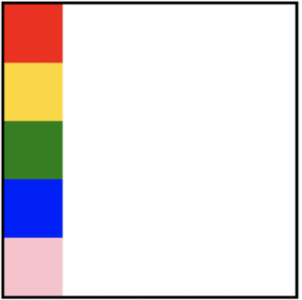
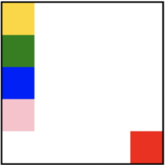
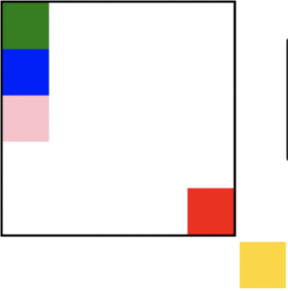
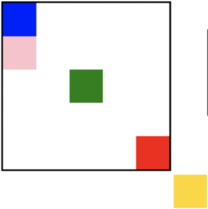
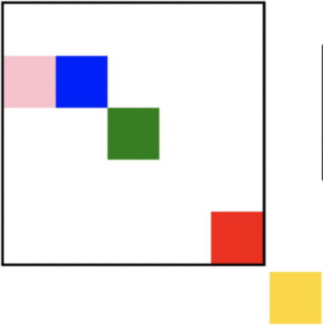
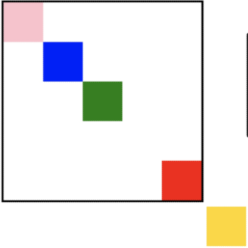

# CSS

> Cascading Style Sheets
>
>  스타일을 지정하기 위한 언어


## 구성요소

선택자(Selector), 선언(Declaration), 속성(Property), 값(Value)

```css
h1 {
    color: blue;
    font-size: 15px;
}
```

- 선택자 = h1
- 선언 = color: blue;
- 속성 = font-size
- 값 = 15px 


## CSS 정의방법


#### 1. 인라인

```html
<h1 style="color: blue; font-size: 100px;">Hello</h1>
```

해당 태그에 직접 style 속성을 활용


#### 2. 내부 참조

```html
<head>
    <style>
    	h1 {
        	color: blue;
        	font-size: 100px;
    	}
	</style>
</head>
```

`<head>` 태그 내에 `<style>`에 지정


#### 3. 외부 참조

```html
<head>
    <title>mySite</title>
    <link rel="stylesheet" href="mystyle.css"
</head>
```

외부 CSS 파일을 `<head>`내 `<link>`를 통해 불러오기


#### 개발자 도구

- styles : 해당 요소에 선언된 모든 CSS
- computed : 해당 요소에 최종 계산된 CSS


## CSS Selectors

- 기본선택자
  - 전체 선택자, 요소 선택자
  - 클래스 선택자, 아이디 선택자, 속성 선택자
- 결합자
  - 자손 결합자, 자식 결합자
  - 일반 형제 결합자, 인접 형제 결합자
- 의사 클래스/요소(Pseudo Class)
  - 링크, 동적 의사 클래스
  - 구조적 의사 클래스, 기타 의사 클래스, 의사 앨리먼트, 속성 선택자


```html
<style>
    /* 전체 선택자 */
    * {
        color: red;
    }
    
    /* 요소 선택자 */
    h2 {
        color: orange;
    }
    
    h3,
    h4 {
        font-size: 10px;
    }
    
    /* 클래스 선택자 */
    .green {
        color: green;
    }
    
    /* id 선택자 */
    #Purple {
        color: purple;
    }
    
    /* 자식 결합자 */
    .box > p {
        font-size: 30px;
    }
    
    /* 자손 결합자 */
    .box p :{
        color: blue;
    }
</style>
```


- 요소 선택자 : HTML 태그를 직접 선택 `<태그명>`
- 클래스 선택자 : 마침표 문자로 시작하며, 해당 클래스가 적용된 항목을 선택 `.class`
- 아이디 선택자 : # 문자로 시작하며 해당 아이디가 적용된 항목을 선택, 일반적으로 하나의 문서에 1번만 사용 `#id`

- 자식 선택자 : div 태그 바로 밑에 있는 children 클래스를 가진 것 `div > .children`
- 자손 선택자 : div 태그 하위 모든 baby 클래스를 가진 것 `div .baby`


## CSS 적용 우선순위

- `!important` : 사용 시 주의
- 인라인 style > `#id` > `.class` > `<태그명>` > *(전체선택자)
  - 같은 점수인 경우에는 CSS가 나중에 선언된 것

```css
h2 {
    color: darkviolet !important;
}

p {
    color: orange;
}

.blue {
    color: blue;
}

.green {
    color: green;
}

#red {
    color: red;
}
```

```html
<p>1</p> <!-- orange -->
<p class="blue">2</p> <!-- blue -->
<p class= "blue green">3</p> <!-- green -->
<p class= "green blue">4</p> <!-- green -->
<p id="red" class="blue">5</p> <!-- red -->
<h2 id="red" class="blue">6</h2> <!-- darkviolet -->
<p id="red" class="blue" style="color: yellow;">7</p> <!-- yellow -->
<h2 id="red" class="blue" style="color: yellow;">8</h2> <!-- darkviolet -->
```


## CSS 상속

- 상속을 통해 부모 요소의 속성을 자식에게 상속
- 상속 되는 것 예시
  - Text 관련 요소(font, color, text-align), opacity, visibility
- 상속 되지 않는 것 예시
  - Box model 관련 요소(width, height, margin, padding, border, box-sizing, display), position 관련 요소(position, top/right/bottom/left, z-index) 등


```css
<style>
p {
    /* 상속됨 */
    color: red; 
    /* 상속 안됨 */
    border: 1px solid black;
}

span {
    border: 1px solid blue;
}
</style>
```


## CSS 기본 스타일

#### 크기 단위

- `px`(픽셀)
  - 모니터 해상도의 한 화소인 '픽셀'기준
- `%` 
  - 백분율 단위
  - 가변적인 레이아웃에서 자주 사용
- `em`
  - 바로 위 부모요소에 대한 상속의 영향을 받음
  - 배수 단위
  - 요소에 지정된 사이즈에 상대적인 사이즈를 가짐
- `rem`
  - 바로 위 부모요소에 대한 상속의 영향을 받지 않음
  - 최상위 요소의 사이즈를 기준으로 배수 단위를 가짐
- `viewport`
  - 웹 페이지를 방문한 유저에게 바로 보이게 되는 웹 컨텐츠의 영역
  - 디바이스의 viewport를 기준으로 상대적인 사이즈가 결정됨
  - vw, vh, vmin, vmax


#### 색상 단위

- 색상 키워드
  - 대소문자 구분 X
  - red, blue, black과 같은 특정 색을 직접 글자로 나타냄
- RGB 색상
  - 16진수 표기법 혹은 함수형 표기법을 사용해서 특정 색을 표현하는 방식
- HSL 색상
  - 색상, 채도, 명도를 통해 특정 색을 표현하는 방식

```css
p { color: black; }
p { color: rgb(0, 0, 0); }
p { color: hsl(120, 100%, 0); }
```


## CSS 결합자

- 자손 결합자 : selectorA 하위의 모든 selectorB 요소 `div span`
- 자식 결합자 : selectorA 바로 아래의 selectorB 요소 `div > span`
- 일반 형제 결합자 : selectorA의 형제 요소 중 뒤에 위치하는 selectorB 요소를 모두 선택 `p ~ span`
- 인접 형제 결합자 : selectorA의 형제 요소 중 바로 뒤에 위치하는 selectorB 요소를 선택 `p + span`


## Box model

> 모든 요소는 네모(박스모델)이고, 위에서부터 아래로, 왼쪽에서 오른쪽으로 쌓인다
>
> display에 따라 크기와 배치가 달라진다

박스모델 구성요소

- content
- padding
- border
- margin


#### padding

```css
.margin-padding {
    margin: 10px;
    padding: 30px;
}
```

상하좌우


#### border

```css
.border {
    border-width: 2px;
    border-style: dashed;
    border-color: black;
}
```

상하좌우


#### margin 

```css
.margin-1 {
    margin: 10px; /* 상하좌우 */
}

.margin-2 {
    margin: 10px 20px; /* 상하, 좌우 */
}

.margin-3 {
    margin: 10px 20px 30px; /* 상, 좌우, 하 */
}

.margin-4 {
    margin: 10px 20px 30px 40px /* 상, 우, 하, 좌(시계방향) */
}
```

shorthand를 통해 표현 가능


#### box-sizing

```css
.box {
    /* public box */
    width: 100px;
    margin: 10px auto;
    padding: 20px;
    border: 1px solid black;
    color: white;
    text-align: center;
    background-color: blueviolet;
}
```

일반적으로 영역을 볼때는 border까지의 너비를 100px 보는 것을 원함

- 그 경우 box-sizing을 border-box로 설정


#### display

- display : block
  - 줄 바꿈 일어나는 요소
  - 화면 크기 전체의 가로 폭 차지
  - 블록 레벨 요소 안에 인라인 레벨 요소 들어갈 수 있음
  - div / ul, ol, li / p / hr / form 등
- display : inline
  - 줄 바꿈 일어나지 않는 행의 일부 요소
  - content 너비만큼 가로 폭 차지
  - width, height, margin-top, margin-bottom을 지정할 수 없다
  - 상하 여백은 line-height로 지정
  - span / a / img / input, label / b, em, i, strong 등


- `margin-right: auto;` 왼쪽 정렬
- `margin-left: auto;` 오른쪽 정렬
- `margin-right: auto; margin-left:auto;` 가운데 정렬 


- display: inline block
  - block과 inline 레벨 요소의 특징 모두 가짐
  - inline처럼 한 줄에 표시 가능, block처럼 모든 속성을 지정할 수 있음
- display: none
  - 해당 요소를 화면에 표시하지 않고, 공간조차 부여되지 않음
  - 이와 비슷한 visibility: hidden은 해당 요소가 공간은 차지하나 화면에 표시하지 않음


## CSS Position

- relative : 상대 위치
  - 자기 자신의 static 위치를 기준으로 이동(normal flow 유지)
  - 레이아웃에서 요소가 차지하는 공간은 static 때와 같음
- absolute : 절대 위치
  - 요소를 일반적인 문서 흐름에서 제거 후 레이아웃에 공간을 차지하지 않음(normal flow에서 벗어남)
  - static이 아닌 가장 가까이 있는 부모/조상 요소를 기준으로 이동
- fixed : 고정 위치
  - 요소를 일반적인 문서 흐름에서 제거 후 레이아웃에 공간을 차지하지 않음(normal flow에서 벗어남)
  - 부모 요소와 관계없이 viewport를 기준으로 이동




```css
.big-box {
    position: relative;
    margin: 100px auto 500px;
    border: 5px solid black;
    width: 500px;
    height: 500px;
}

.small-box {
    width: 100px;
    height: 100px;
}
```




```css
#red {
    background-color: red;
    postion: absolute;
    top: 400px;
    left: 400px;
}
```




```css
#gold {
    background-color: gold;
    position: fixed;
    bottom: 50px;
    right: 50px;
}
```




```css
#green {
    background-color: green;
    position: absolute;
    top: 200px;
    left: 200px;
}
```




```css
#blue {
    background-color: blue;
    position: relative;
    top:100px;
    left: 100px;
}
```




```css
#pink {
    background-color: pink;
    position: absolute;
    top: 0px;
    left: 0px;
}
```


#### CSS 원칙

1. 모든 요소는 박스 모델, 좌측상단에 배치
2. display에 따라 크기와 배치가 달라짐
3. position으로 위치의 기준을 변경(relative, absolute, fixed)


## 개발자 도구

- elements : 해당 요소의 HTML 태그
- styles : 해당 요소에 선언된 모든 CSS
- computed : 해당 요소에 최종 계산된 CSS


