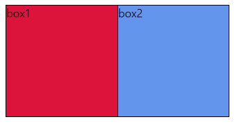
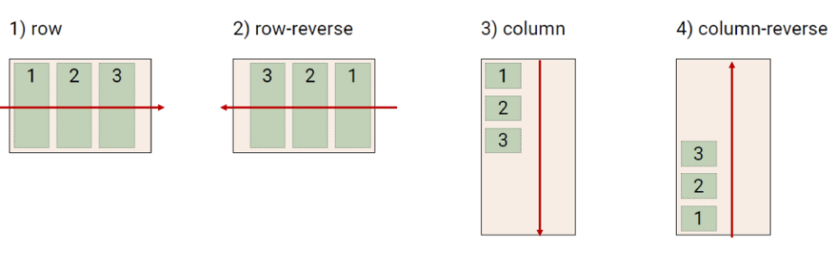
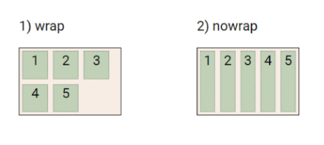
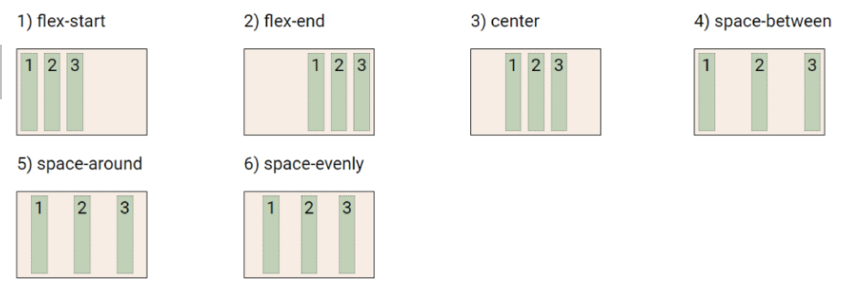
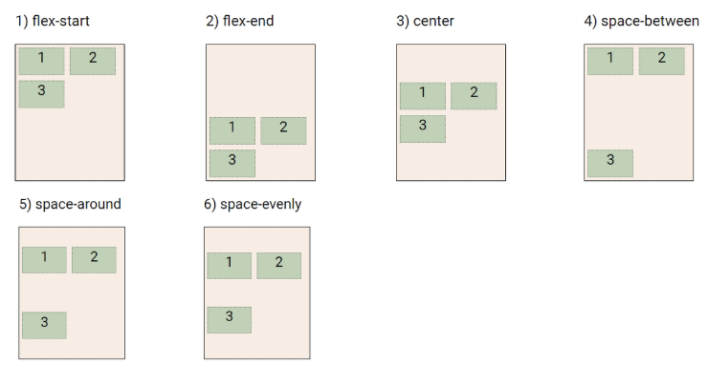
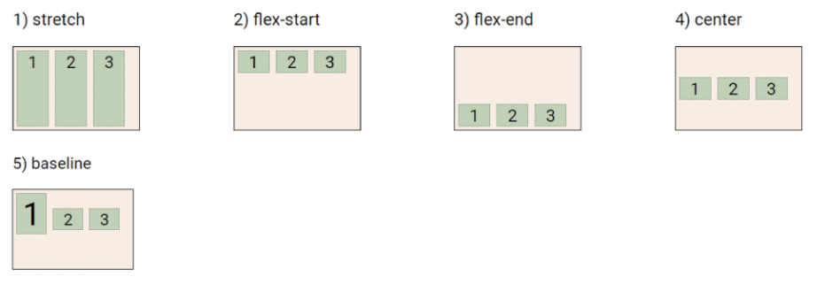
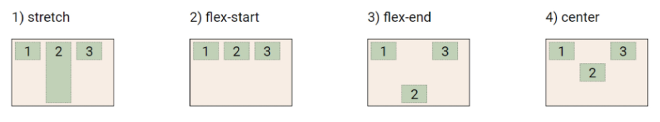

# Layout

## Float

> 박스를 왼쪽 혹은 오른쪽으로 이동시켜 텍스트를 포함 인라인요소들이 주변을 wrapping 하도록 함
>
> 요소가 Normal flow를 벗어나도록 함

```html
<style>
    .box1 {
        /* 10rem => 160px (root -> 16px) */
        width: 10rem;
        height: 10rem;
        border: 1px solid black;
        background-color: crimson;
    }

    .box2 {
        /* 10rem => 160px (root -> 16px) */
        width: 20rem;
        height: 10rem;
        border: 1px solid black;
        background-color: cornflowerblue;
    }

    .left {
        float: left;
    }
</style>


<body>
    <div class="box1 left">box1</div>
    <div class="box2">box2</div>
</body>
```



- box2의 폭이 작아진 것이 아니라 float된 box1이 box2에 떠있는 형태
- float 되는 경우 텍스트 및 인라인 요소가 그 주위를 감싸는 형태가 되므로 텍스트는 밀어냄!


#### Clearing float

- 이후 요소에 대하여 Float 속성이 적용되지 않도록 하는 필수적인 작업
- (Float는 Normal flow에서 벗어난 부동 상태이므로) 
- 보통 `::after`를 content 속성과 함께 짝지어 사용한다.
- clear 속성부여

```css
.clearfix::after {
    content: "";
    display: block;
    clear: both;
}
```

- Float는 Flexbox, Grid 의 등장과 함께 사용도 낮아짐


## Flexbox

> 행과 열 형태로 아이템들을 배치하는 1차원 레이아웃 모델

- 축 : main axis(메인 축), cross axis(교차 축)
- 구성요소 : Flex Container(부모 요소), Flex Item(자식 요소)

- 부모 요소의 display 속성을 flex 혹은 inline-flex로 지정
- 이전까지 Normal Flow를 벗어나기 위해 Float, Position을 활용했지만 수직 정렬, 아이템의 너비/높이/간격 등을 동일하게 배치하는 것에 어려움을 겪음


#### 속성(flex 내에 적용)

- 배치 설정
  - flex-direction
    - row(좌->우)
    - row-reverse(우->좌)
    - column(상->하)
    - column-reverse(하->상)
    
    
    
  - flex- wrap
    - wrap(요소들이 넘치면 다음 줄에 배치)
    - nowrap(요소들이 한줄에 배치)
    
    
  
- 공간 나누기
  - justify-content (main axis 기준으로 공간 배분)
    - flex-start(s쪽에 몰림)
    - flex-end(e쪽에 몰림)
    - center(중앙에 몰림)
    - space-between(같은 space를 items 사이에)
    - space-around(모든 item 기준으로 같은 길이의 space를 양쪽에)
    - space-evenly(전체 영역에서 s, item, e 모두 같은 길이의 간격)
    
    
    
  - align-content(cross axis)
    - flex-start
    - flex-end
    - center
    - space-between
    - space-ground
    - space-evenly
    
    
  
- 정렬
  - align-items (모든 아이템을 cross axis 기준으로)
    - stretch(컨테이너 가득 채움)
    - flex-start(s쪽에 몰림)
    - flex-end(e쪽에 몰림)
    - center(가운데)
    - baseline(텍스트 baseline에 기준선 맞춤)
    
    
    
  - align-self (개별 아이템을 cross axis 기준으로)
    - stretch
    - flex-start
    - flex-end
    - center
    
    
  
- 기타 속성
  - flex-grow (남은 영역을 아이템에 분배)
  - order (배치 순서)

