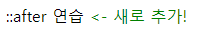
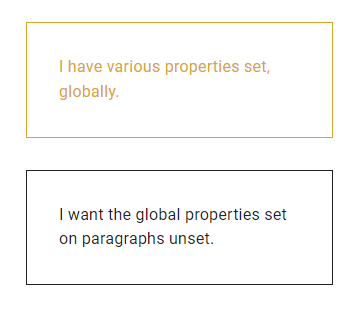

# LearnCSS_01

> `000` Learn CSS ~ `007` Sizing Units


## Attribute selector

> 속성 선택자

```html
<div data-type="primary"></div>
<div data-type="secondary"></div>
```


```css
/* primary에 적용 */
[data-type='primary']{
  color: red;
}

/* 대소문자 구분하는 속성 선택자 */
[data-type='primary' s] {
  color: red;
}

/* 속성이 있는 모든 요소에 적용 */
[data-type] {
  color: red;
}
```


- 꿀팁

```css
/* A href that contains "example.com" */
[href*='example.com'] {
  color: red;
}

/* A href that starts with https */
[href^='https'] {
  color: green;
}

/* A href that ends with .com */
[href$='.com'] {
  color: blue;
}
```


## Grouping selector

> 그룹화 선택자

```css
strong,
em,
.my-class,
[lang] {
  color: red;
}
```


## Pseudo-class

> 가짜 클래스, 의사 클래스, 가상 클래스

- `:hover`, `:visited`, `:link`, `:active`, `:focus`, `:nth-child`, `:nth-of-type` 등

```css
/* Our link is hovered */
/* Any button over which the user's pointer is hovering */
a:hover {
  outline: 1px dotted green;
}

/* Sets all even paragraphs to have a different background */
p:nth-child(even) {
  background: floralwhite;
}
```


## Pseudo-element

> 가짜 요소, 의사 요소


- `::after` : 요소의 맨 마지막 자식으로 요소를 하나 생성

```html
<p class="after-practice">::after 연습</p>
```

```css
.after-practice::after {
  content: " <- 새로 추가!";
  color: green;
}
```



- `::marker` : 목록의 글머리 기호(번호) 스타일 지정

```css
/* Your list will now either have red dots, or red numbers */
li::marker {
  color: red;
}
```

- `::selection` : 사용자가 강조 표시한 콘텐츠 스타일 지정

```css
::selection {
  background: black;
  color: white;
}
```

- 그외 `::before`, `::first-letter`, `::first-line` 등


## Combinators

> 결합자

`div p` : `<p>` 요소 내부의 모든 요소 선택

`div > p` : `<p>` 요소 자식인 모든 요소 선택

`div + p` : `<p>` 요소 바로 뒤 첫 요소 선택

`div ~ p` : `<p>` 요소 다음 형제인 모든 요소 선택

`.my-class *` : `.my-class`의 모든 하위 요소 선택

`a.my-class` : `my-class`를 포함하는 `<a>` 요소를 대상으로 함


## Visualizing Specificity

> 특이성(우선순위) 시각화

ID개수 - 클래스 개수 - 요소 개수

```css
a.my-class.another-class[href]:hover {} /* 0-4-1 => 41점 */ 
#specialty:hover li.dark {} /* 1-2-1 => 121점 */
.my-button.my-button {} /* 0-2-0 => 20점 */
```


## Inherit

> 부모 객체의 값을 가져옴

```css
strong {
  font-weight: 900;
}

.my-component {
  font-weight: 500;
}

.my-component strong {
  font-weight: inherit;
} /* <strong> 내의 font-weight: 500; */
```


## Initial

> 기본 설정값으로 되돌림(초기화)

```css
aside strong {
  font-weight: initial;
}
```


## Unset

> 상속할 값이 존재하면 상속값을 가져오고(inherit처럼), 그렇지 않다면 초기값을 가져옴(initial처럼)

```css
/* Global color styles for paragraph in authored CSS */
p {
	margin-top: 2em;
	color: goldenrod;
	padding: 2em;
	border: 1px solid;
}

/* Not all properties are accounted for anymore */
aside p {
	margin: unset;
	color: unset;
    /* all: unset;처럼 사용 가능(이 경우 padding, border 등도 모두 날아감) */
}

/* Decorative styles */
aside {
  margin-top: 2em;
}
```




## Color

> 색상의 여러 표현법

- `#b71540`
- `rgb(183, 21, 64)`
- `hsl(344, 79%, 40%)` : 색상, 채도, 명도
- `hsla(0, 0%, 0%, 0.5)` : 색상, 채도, 명도, 투명도(0~1 or 0%~100%)
- `hotpink` : named colors


## Lengths

- Absolute lengths
  - `cm` : Centimeters
  - `mm` : Millimeters
  - `Q` : Quarter-millimeters
  - `in` : Inches
  - `pc` : Picas
  - `pt` : Points
  - `px` : Pixels
- Relative lengths
  - `em` : computed font size에 대한 비율
  - `ex` 
  - `cap` : 대문자 높이
  - `ch` : 평균 문자 자간
  - `ic` : 평균 문자 전각 길이
  - `rem` : font size of the root element
  - `lh` : line height
  - `rlh` : line height of the root element
- Viewport-relative units (viewport = 가상의 window상 페이지)
  - `vw`
  - `vh`
  - `vi`
  - `vb`
  - `vmin`
  - `vmax`


## rotate

```css
div {
  width: 150px;
  height: 150px;
  transform: rotate(60deg);
}
```

