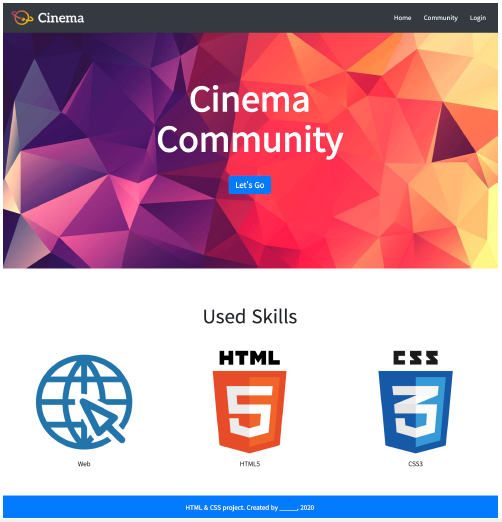

# practice_bootstrap

> Cinema 클론코딩하기 (bootstrap component 이용)




```css
@import url('https://fonts.googleapis.com/css?family=Noto+Sans+KR');

/* 아래의 코드는 수정하지 마세요. */
body {
  height: 3000px;
  margin: 0;
  font-family: 'Noto Sans KR', sans-serif;
}

nav {
  height: 80px;
}

nav img {
  height: 80px;
}

header {
  height: 700px;
  background-image: url('images/header.jpg');
  background-size: cover;
}

section > h2 {
  font-size: 3rem;
}

section img {
  width: 300px;
}

footer {
  height: 60px;
}


/* 추가적으로 작성하고 싶은 순수 CSS 코드가 있다면 해당 주석 아래에 작성해 주세요. */

```


```html
<!DOCTYPE html>
<html lang="ko">
<head>
  <meta charset="UTF-8">
  <meta name="viewport" content="width=device-width, initial-scale=1.0">
  <link rel="stylesheet" href="style.css">
  <title>Document</title>
  <link href="https://cdn.jsdelivr.net/npm/bootstrap@5.1.3/dist/css/bootstrap.min.css" rel="stylesheet" integrity="sha384-1BmE4kWBq78iYhFldvKuhfTAU6auU8tT94WrHftjDbrCEXSU1oBoqyl2QvZ6jIW3" crossorigin="anonymous">
</head>
<body>
  <!-- 1. Nav -->
  <nav class="fixed-top bg-dark d-flex w-auto justify-content-between">
    <a href="#">
      
    </a>
    <ul class="nav flex-row justify-content-center align-content-center">
      <li class="m-3"><a href="#" class="text-decoration-none text-white ">Home</a></li>
      <li class="m-3"><a href="#" class="text-decoration-none text-white">Community</a></li>
      <li class="m-3"><a href="#" class="text-decoration-none text-white">Login</a></li>
    </ul>
  </nav>

  <!-- 2. Header -->
  <header class="d-flex row justify-content-center align-content-center text-white text-center fw-bold clearfix">
      <div class="display-1">Cinema</div>
      <div class="display-1">Community</div>
      <a href="#" type="button" class="btn btn-primary btn-lg m-5" style="width: 10%;">Let's Go</a> <!-- 억지 1 -->
  </header>

  <!-- 3. Section -->
  <section class="d-flex row justify-content-center text-center">
    <h2 class="mt-5 mb-4">Used Skills</h2>
    <article class="row">
      <div class="col"> <!-- 억지 2 -->
        
        <p>Web</p>
      </div>
      <div class="col">
        
        <p>HTML5</p>
      </div>
      <div class="col">
        
        <p>CSS3</p>
      </div>
    </article>
  </section>

  <!-- 4. Footer -->
  <footer class="flex-row fixed-bottom bg-primary text-white text-center p-3"> <!-- 억지 3 -->
    <p>HTML & CSS project. Created by _____</p>
  </footer>

  <script src="https://cdn.jsdelivr.net/npm/bootstrap@5.1.3/dist/js/bootstrap.bundle.min.js" integrity="sha384-ka7Sk0Gln4gmtz2MlQnikT1wXgYsOg+OMhuP+IlRH9sENBO0LRn5q+8nbTov4+1p" crossorigin="anonymous"></script>
</body>
</html>
```

