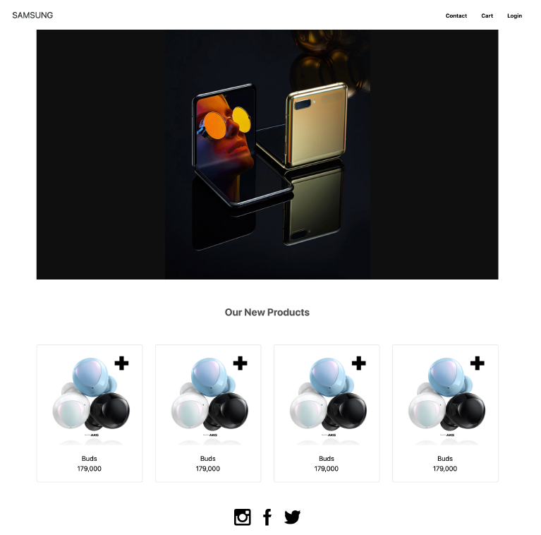

# practice_shop

## problem




## html

```html
<!DOCTYPE html>
<html lang="en">
<head>
  <meta charset="UTF-8">
  <meta name="viewport" content="width=device-width, initial-scale=1.0">
  <link rel="stylesheet" href="shop.css">
  <link href="https://cdn.jsdelivr.net/npm/bootstrap@5.1.3/dist/css/bootstrap.min.css" rel="stylesheet" integrity="sha384-1BmE4kWBq78iYhFldvKuhfTAU6auU8tT94WrHftjDbrCEXSU1oBoqyl2QvZ6jIW3" crossorigin="anonymous">
  <title>Title</title>
</head>
<body>
  <!-- nav -->
  <nav class="d-flex sticky-top justify-content-between px-3"> <!-- fixed-top보단 sticky-top이 대세 -->
    <a>SAMSUNG</a>
    <ulL class="nav flex-row justify-content-center">
      <li class="mx-2"><a href="#" class="text-decoration-none text-black">Contact</a></li>
      <li class="mx-2"><a href="#" class="text-decoration-none text-black">Cart</a></li>
      <li class="mx-2"><a href="#" class="text-decoration-none text-black">Login</a></li>
    </ulL>
  </nav>

  <div class="container">
    <!-- section -->
    <section>
       <!-- 핵심 1: img-fluid를 사용하여 이미지에 반응성 적용 -->
    </section>

    <!-- article -->
    <article class="text-center">
      <p class="my-5">Our New Product</p>
      
      <div class="row"> <!-- 핵심 3: row > (col > 내용)*4의 형태로 grid sytem 사용! -->
        <div class="col-12 col-sm-6 col-md-3">
          <div class="card"> <!-- 핵심 2: 사실 버즈 사진은 card 형태였음 -->
            <a href="#"></a>
            <div class="card-body">
              <p class="card-title">Buds</p>
              <p class="card-text">179,000</p>
            </div>
          </div>
        </div>
        <div class="col-12 col-sm-6 col-md-3">
          <div class="card"> <!-- 핵심 2: 사실 버즈 사진은 card 형태였음 -->
            <a href="#"></a>
            <div class="card-body">
              <p class="card-title">Buds</p>
              <p class="card-text">179,000</p>
            </div>
          </div>
        </div>
        <div class="col-12 col-sm-6 col-md-3">
          <div class="card"> <!-- 핵심 2: 사실 버즈 사진은 card 형태였음 -->
            <a href="#"></a>
            <div class="card-body">
              <p class="card-title">Buds</p>
              <p class="card-text">179,000</p>
            </div>
          </div>
        </div>
        <div class="col-12 col-sm-6 col-md-3">
          <div class="card"> <!-- 핵심 2: 사실 버즈 사진은 card 형태였음 -->
            <a href="#"></a>
            <div class="card-body">
              <p class="card-title">Buds</p>
              <p class="card-text">179,000</p>
            </div>
          </div>
        </div>
      </div>

    </article>

    <!-- footer -->
    <footer class="d-flex justify-content-center my-5">
      <a class="text-decoration-none mx-2" href="https://www.instagram.com">
        
      </a>
      <a class="text-decoration-none mx-2" href="https://www.facebook.com">
        
      </a>
      <a class="text-decoration-none mx-2" href="https://www.twitter.com">
        
      </a>
    </footer>
  </div>
  <script src="https://cdn.jsdelivr.net/npm/bootstrap@5.1.3/dist/js/bootstrap.bundle.min.js" integrity="sha384-ka7Sk0Gln4gmtz2MlQnikT1wXgYsOg+OMhuP+IlRH9sENBO0LRn5q+8nbTov4+1p" crossorigin="anonymous"></script>
</body>
</html>
```


## Result


#### 트러블 슈팅

1. 처음에 container가 너무 작아 모든 배열이 안맞는 문제 발생
   - 구글링을 통해 container-fluid를 적용시켜 container에 반응성 적용
     - 이후 모든 요소들이 container의 폭에 맞춰 폭이 조절되어서 문제 발생
       - 첫 이미지에 맞춰 img-fluid 적용시켜 해결

2. 버즈 이미지와 문구들을 하나로 묶어 border 처리하였더니 grid system 적용에 문제 발생
   - 저 형태는 card 였음..
     - card형 레이아웃을 기억하자
3. Grid system 적용시 `<div class="row">` 안에 `<div class="col">` 여러개를 넣고 각각의 `<div class="col">` 안에 내용을 넣는 형태로 사용됨을 기억하자
4. footer부분의 아이콘은 css에서 클래스를 따로 지정하여 width: 2rem;을 주는 것과 그냥 인라인에서 width="35rem"를 주는 것이 크기가 비슷하더라
   - rem은 요소를 기준으로 그 크기를 지정하는데 기준이 되는 요소가 달라지기 때문인 것으로 추측됨

