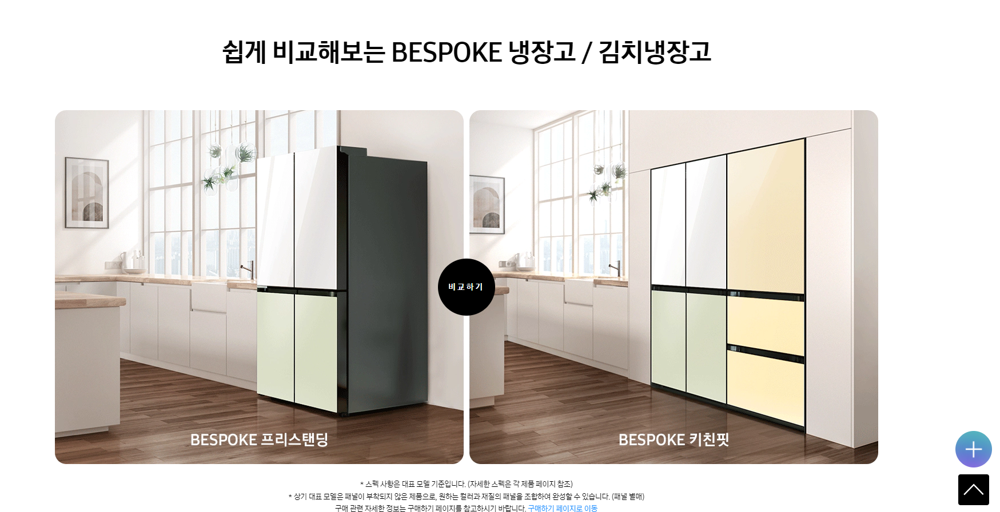
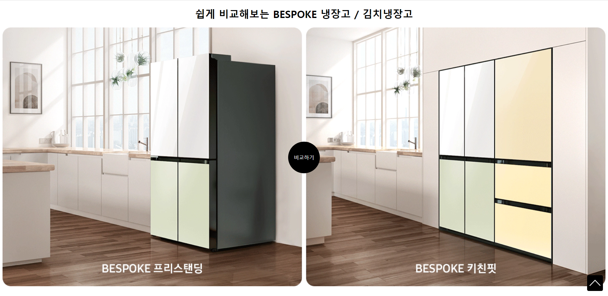

# practice_compare


## BESPOKE 냉장고 클론코딩하기




```html
<!DOCTYPE html>
<html lang="ko">
<head>
  <meta charset="UTF-8">
  <meta http-equiv="X-UA-Compatible" content="IE=edge">
  <meta name="viewport" content="width=device-width, initial-scale=1.0">
  <title>BESPOKE 김치플러스 | Samsung대한민국</title>
  <link rel="stylesheet" href="compare.css">
</head>
<body>
  <!-- https://www.samsung.com/sec/kimchi-refrigerators/bespoke-kimchi-plus/ -->
  <h1 class="title">쉽게 비교해보는 BESPOKE 냉장고 / 김치냉장고</h1>
  <section class="compare">
    
    <a class="compare-button" href="#">비교하기</a>
  </section>
  <div class="top-button">
    
  </div>
</body>
</html>
```


```css
/* 제목 */
.title {
  text-align: center;
}

/* 버튼 스타일링 및 위치 */
.compare {
  position: relative;
  /* compare은 compare-button, compare-image의 부모이며 이 부모에
  relative를 적용해주어야 자식 요소들이 이 부모 요소의 위치를 기준으로
  배치될 것이므로 compare에 relative를 걸어준 것! */
}

.compare-button {
  display: block;
  width: 100px;
  height: 100px;
  background-color: black;
  border-radius: 50%;
  color: white;
  text-decoration: none; /* href 때문에 밑줄이 그어졌는데 그걸 없애는 코드*/
  text-align: center;
  line-height: 100px;

  position: absolute;
  top: 50%;
  left: 50%;
  transform: translate(-50%, -50%); 
  /* 버튼이 공간을 차지하느라 시작 위치가 (0,0)이 아니고 (50px, 50px)
  이기 때문에(width/2, height/2) top, left를 50%씩 주어도 중앙으로
  가지 않는다. 따라서 요소의 표시 위치를 이동시켜주는 transform: translate
  를 사용하여 (-50%, -50%)만큼 옮기면 진짜 중앙에 위치할 수 있다. */
}

.compare-image {
  width: 100%
}


/* top 버튼 */
.top-button {
  width: 50px;
  height: 50px;
  background-color: black;
  text-align: center;
  line-height: 60px;
  border-radius: 10%;

  position: fixed;
  bottom: 0;
  right: 0;
  margin: 1rem;
}
```


## result


