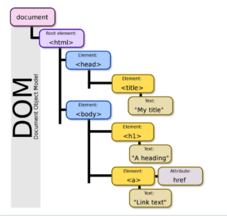

# HTML

> Hyper Text Markup Language.
>
> 웹 페이지를 작성(구조화)하기 위한 언어

- Hyper Text : 하이퍼링크를 통해 사용자가 한 문서에서 다른 문서로 즉시 접근할 수 있는 텍스트
- 태그 등을 이용하여 문서나 데이터의 구조를 명시하는 언어


## 기본 구조

- `html` : 문서의 최상위 요소
- `head` : 문서 메타데이터 요소
  - 문서 제목, 인코딩, 스타일, 외부 파일 로딩 등
  - 일반적으로 브라우저에 나타나지 않음
- `body` : 문서 본문 요소
  - 실제 화면 구성과 관련된 내용


- `<title>` : 브라우저 상단 타이틀
- `<meta>` : 문서 레벨 메타데이터 요소
- `<link>` : 외부 리소스 연결 요소(CSS 파일, favicon)
- `<script>` : 스크립트 요소(JavaScript 파일/코드)
- `<style>` :  CSS 직접 작성

```html
<head>
    <title>HTML 수업</title>
    <meta charset="UTF-8">
    <link href="style.css" rel="stylesheet">
    <script src="javascript.js"></script>
    <style>
        p{
            color: black;
        }
    </style>
</head>

<!-- emmet하면(! 와 tab 누르면) 기본적인거 만들어짐 -->
```


#### DOM(Document Object Model) 트리

- 텍스트 파일인 HTML 문서를 브라우저에서 렌더링 하기 위한 구조




#### 요소

> HTML의 요소는 태그와 내용으로 구성되어 있다.

- 시작(여는) 태그와 종료(닫는) 태그 그리고 그 사이에 위치한 내용으로 구성
- 내용이 없는 태그들 : br, hr, img, input, link, meta
- 요소는 중첩될 수 있으며 중첩을 통해 하나의 문서를 구조화  => 태그 쌍을 잘 확인할 것


#### 속성

- 속성을 통해 태그의 부가적인 정보 설정 가능
- 요소는 속성을 가질 수 있으며, 경로나 크기와 같은 추가적인 정보 제공
- 요소의 시작 태그에 작성하며 보통 이름과 값이 하나의 쌍으로 존재
- 태그와 상관없이 사용 가능한 속성(HTML Global Attribute)들도 있음
  - `id` : 문서 전체에서 유일한 고유 식별자 지정
  - `class ` : 공백으로 구분된 해당 요소의 클래스 목록
  - `data-*` : 페이지에 개인 사용자 정의 데이터를 저장하기 위해 사용
  - `style` : inline 스타일
  - `title` : 요소에 대한 추가 정보 지정
  - `tabindex` : 요소의 탭 순서


#### 시맨틱 태그

> HTML5에서 등장한 의미론적 요소를 담은 태그, 기존 영역을 의미하는 div 태그를 대체하여 사용

- `header` :  문서 전체나 섹션의 헤더(머리말)
- `nav` : 내비게이션
- `aside` : 사이드에 위치한 공간, 메인 콘텐츠와 관련성이 적은 콘텐츠
- `section` : 문서의 일반적인 구분, 콘텐츠의 그룹을 표현
- `article` : 문서, 페이지, 사이트 안에서 독립적으로 구분되는 영역
- `footer` : 문서 전체나 섹션의 푸터(마지막 부분)


## HTML 문서 구조화

#### 텍스트 요소

- `<a></a>` : href 속성을 활용하여 다른 URL로 연결하는 하이퍼링크 생성

```html
<a href="https://google.com"></a>
```

- `<b></b>`, `<strong></strong>` : 굵은 글씨 요소
- `<i></i>`, `<em></em>` : 기울임 글씨 요소
- `<br>` : 텍스트 내에 줄바꿈 생성
- `` : src 속성을 활용하여 이미지 표현

```html

```

- `<span></span>` : 의미 없는 인라인 컨테이너


#### 그룹 컨텐츠

- `<p></p>` : 하나의 문단
- `<hr>` : 수평선
- `<ol></ol>`, `<ul></ul>` : 순서가 있는 리스트, 순서가 없는 리스트
- `<pre></pre>` : HTML에 작성한 내용을 그대로 표현, 고정폭 글꼴 사용, 공백문자 유지
- `<blockquote></blockquote>` : 텍스트가 긴 인용문
- `<div></div>` : 의미 없는 블록 레벨 컨테이너


#### table

- 영역 : 맨 윗줄 thead, 맨 밑 tfoot, 그 사이에 tbody라는 영역이 존재

- `tr` : 표 안의 가로 줄들
- `th` : 첫 번째 줄에 있는 셀들
- `td` : 첫 번째 줄이 아닌 곳에 있는 셀들
- `colspan` : colspan="2"와 같이 써서 셀을 병합할 수 있음

- `caption` : 표 밖에서 설명 또는 제목을 나타냄

```html
<!DOCTYPE html>
<html>
  <head>
    <title>테이블 실습</title>
    <style>
      td, th {
        text-align: center;
        border: 1px solid gray
      }
    </style>
  </head>
  <body>
    <table>
      <thead>
        <tr>
          <th>ID</th>
          <th>Name</th>
          <th>Major</th>
        </tr>
      </thead>
      <tbody>
        <tr>
          <td>1</td>
          <td>홍길동</td>
		  <td>computer science</td>
        </tr>
        <tr>
          <td>2</td>
          <td>김철수</td>
          <td>Business</td>
        </tr>
      </tbody>
      <tfoot>
        <tr>
          <td>총계</td>
          <td colspan="2">2명</td>
		</tr>
      </tfoot>
      <caption>1반 학생 명단</caption>
    </table>
  </body>
</html>
```


#### form

> 정보(데이터)를 서버에 제출하기 위한 영역

- 기본 속성
  - `action` : form을 처리할 서버의 URL
  - `method` : form을 제출할 때 사용할 HTTP 메서드
  - `enctype` : method가 post인 경우 데이터 유형

- 대표적인 속성

  - `name` : form control에 적용되는 이름
  - `value` : form control에 적용되는 값
  - required, readonly, autofocus, autocomplete, diabled 등

- input label

  - label을 클릭하여 input 자체의 초점을 맞추거나 활성화 시킬 수 있음
  - `<input>`에 id 속성을, `<label>`에는 for 속성을 활용하여 상호 연관시킴

  ``` html
  <label for="agreement">개인정보 수집에 동의합니다.</label>
  <input type="checkbox" name="agreement" id="agreement">
  ```

  

```html
<!-- emmet(! tab)-->
<!DOCTYPE html>
<html lang="en">
<head>
  <meta charset="UTF-8">
  <meta http-equiv="X-UA-Compatible" content="IE=edge">
  <meta name="viewport" content="width=device-width, initial-scale=1.0">
  <title>Document</title>
</head>
<body>
  <h1>Form 실습</h1>
  <div>
    <label for="username">아이디</label>
    <input type="text" id="username" autofocus>
  </div>
  <div>
    <label for="password">비밀번호</label>
    <input type="password" id="password" disabled>
  </div>
  <div>
    <label for="agreement">개인정보수집동의</label>
    <input type="checkbox" name="" id="agreement">
  </div>
    
  <input type="submit" value="제출">
</body>
```


- input 유형(일반)
  - `text` : 일반 텍스트 입력
  - `password` : 입력 시 값이 보이지 않고 문자를 특수기호(*)로 표현
  - `email` : 이메일 형식이 아닌 경우 form 제출 불가
  - `number` : min, max, step 속성을 활용하여 숫자 범위 설정 가능
  - `file` : accept 속성을 활용하여 파일 타일 지정 가능
- input 유형(항목 중 선택)
  - `checkbox` : 다중 선택
  - `radio` : 단일 선택
- input 유형(기타)
  - `color` : color picker
  - `date` : date picker
  - `hidden` : 사용자에게 보이지 않는 input

```html
<!DOCTYPE html>
<html lang="en">
<head>
  <meta charset="UTF-8">
  <meta http-equiv="X-UA-Compatible" content="IE=edge">
  <meta name="viewport" content="width=device-width, initial-scale=1.0">
  <title>Document</title>
</head>
<body>
  <header>
      
      <h1>SSAFY 건강설문</h1>
  </header>
</body>
<section>
  <form action="#">
    <!-- 이름 -->
    <div>
      <label for="name">이름을 기재해주세요.</label><br>
      <input type="text" id="name" name="name" autofocus>
    </div>
    <hr>
    <!-- 지역 -->
    <div>
      <lable for="region">지역을 선택해주세요</lable><br>
      <select name="region" id="region" required>
        <option value="">선택</option>
        <option value="서울">서울</option>
        <option value="대전">대전</option>
        <option value="광주">광주</option>
        <option value="구미">구미</option>
        <option value="부울경">부울경</option>
        <option value="강원" disabled>강원</option>
      </select>
    </div>
    <hr>
    <!-- 체온 -->
    <div>
      <p>오늘의 체온을 선택해주세요</p>
      <input type="radio" name="body_heat" id="normal" value="normal" checked>
      <label for="normal">37도 미만</label><br>
      <input type="radio" name="body_heat" id="warning" value="warning">
      <label for="warning">37도 이상</label>
    </div>
    <hr>
    <input type="submit" value="제출">
  </form>
</section>
<footer>Google 설문지를 통해 비밀번호를 제출하지 마시오.</footer>
</html>
```


```html
<!DOCTYPE html>
<html lang="en">
<head>
  <meta charset="UTF-8">
  <meta http-equiv="X-UA-Compatible" content="IE=edge">
  <meta name="viewport" content="width=device-width, initial-scale=1.0">
  <title>Document</title>
  <style>
    input {
      display: block;
      margin-bottom: 10px;
    }
    input[type="checkbox"] {
      display: inline;
    }
    input[type="radio"] {
      display: inline;
    }
  </style>
</head>
<body>
  <form action="">
    <div>
      <input type="submit" value="제출 확인해보기">
    </div>
    <!-- 일반 입력 -->
    <div>
      <p>text</p>
      <input type="text" autofocus>
      <hr>
    </div>
    <div>
      <p>password</p>
      <input type="password">
      <hr>
    </div>
    <div>
      <p>email</p>
      <input type="email">
      <hr>
    </div>
    <div>
      <p>number</p>
      <input type="number">
      <hr>
    </div>
    <div>
      <p>file</p>
      <input type="file">
      <hr>
    </div>
    <!-- 항목 중 선택 -->
    <div>
      <p>checkbox</p>
      <input id="html" type="checkbox" name="language" value="html">
      <label for="html">HTML</label>
      <input id="python" type="checkbox" name="language" value="python">
      <label for="python">파이썬</label>
      <input id="java" type="checkbox" name="language" value="java">
      <label for="java">자바</label>
      <hr>
    </div>
    <div>
      <p>radio button</p>
      <input id="happy" type="radio" name="mood" value="happy">
      <label for="happy">행복</label>
      <input id="sadness" type="radio" name="mood" value="sadness">
      <label for="sadness">슬픔</label>
      <input id="neutral" type="radio" name="mood" value="neutral">
      <label for="neutral">중립</label>
      <hr>
    </div>
    <!-- 기타 -->
    <div>
      <p>color</p>
      <input type="color">
      <hr>
    </div>
    <div>
      <p>date</p>
      <input type="date">
      <hr>
    </div>
    <div>
      <p>hidden</p>
      <input type="hidden">
      <hr>
    </div>
  </form>
</body>
</html>
```

