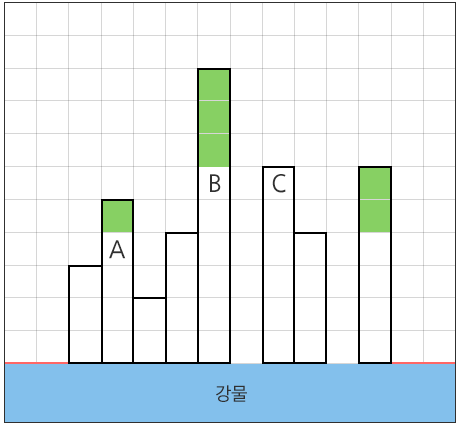

# practice_01


## 1) view



- 연두색 처럼 좌우로 2칸씩 조망권이 확보된 칸의 개수 구하기
- 양쪽 끝 2개에는 0, 0 고정
- tc 10개 고정
- tc 첫 줄에 길이 받음

```python
# 내 풀이
for tc in range(10):
    N = int(input())
    arr = list(map(int, input().split()))

    result = 0
    for i in range(2,N-2):
        cnt = [0]*4
        cnt[0] += (arr[i] - arr[i-2])
        cnt[1] += (arr[i] - arr[i-1])
        cnt[2] += (arr[i] - arr[i+1])
        cnt[3] += (arr[i] - arr[i+2])

        if cnt[0] > 0 and cnt[1] > 0 and cnt[2] > 0 and cnt[3] > 0:
            min_num = cnt[0]
            for j in range(4):
                if cnt[j] < min_num:
                    min_num = cnt[j]
            result += min_num

    print(f'#{tc+1} {result}')
    
    
## 다른 사람들의 일반적인 풀이
for tc in range(10):
    N = int(input())
    arr = list(map(int, input().split()))

    result = 0

    for i in range(2,N-2):
        around = [arr[i-2], arr[i-1], arr[i+1], arr[i+2]]
        maxV = around[0]
        for j in range(4):
            if maxV < around[j]:
                maxV = around[j]

        if maxV < arr[i]:
            result += (arr[i] - maxV)

    print(f'#{tc+1} {result}')
```


## 2) 구간합

> N개의 정수 중에서 이웃한 M개의 합의 `최댓값 - 최솟값` 구하기

```python
# 내 풀이
T = int(input())
for tc in range(1, T+1):
    N, M = map(int, input().split())
    arr = list(map(int, input().split()))
    sums = []
    for i in range(N-M+1):
        sumV = 0
        for j in range(i, i+M):
            sumV += arr[j]
        sums.append(sumV)

    minV = sums[0]
    maxV = sums[0]

    for i in range(N-M+1): 
        if minV > sums[i]:
            minV = sums[i]

    for i in range(N-M+1): # for문 두개 합쳐도 됐을듯
        if maxV < sums[i]:
            maxV = sums[i]

    print(f'#{tc} {maxV - minV}')
    
## 더하고 빼는 방식
T = int(input())
for tc in range(1, T+1):
    N, M = map(int, input().split())
    arr = list(map(int, input().split()))
    sum_list = [0]*(N-M+1) # 합들을 counts의 형태로 만들어줌

    for i in range(M): # 첫번째 합 구하기
        sum_list[0] += arr[i]

    for i in range(N-M): # 뒤에부터는 그전 합에 첫번째 원소를 빼고 뒤의 새로운 원소를 더하는 식으로 연산을 최소화시킴
        sum_list[i+1] = sum_list[i] - arr[i] + arr[i+M]

    min_sum = max_sum = sum_list[0]
    for i in range(N-M+1):
        if min_sum > sum_list[i]:
            min_sum = sum_list[i]
        if max_sum < sum_list[i]:
            max_sum = sum_list[i]

    print(f'#{tc} {max_sum - min_sum}')
```


## 3) 숫자 카드

> 0~9까지 숫자 중 가장 많이 적힌 숫자와 카드가 몇 장인지 출력하는 프로그램

- N = 글자수
- a = 주어지는 카드

```python
T = int(input())
for tc in range(1, T+1):
    N = int(input())
    a = input()
    numbers = [0, 1, 2, 3, 4, 5, 6, 7, 8, 9]
    cnt = [0]*10
 
    for i in range(len(a)):
        for j in range(10):
            if int(a[i]) == numbers[j]:
                cnt[j] += 1
 
    max_cnt = cnt[0]
    for k in range(10):
        if max_cnt <= cnt[k]:
            max_cnt = cnt[k]
            max_num = numbers[k]
 
    print(f'#{tc} {max_num} {max_cnt}')
```


## 4) 전기버스

- 한번 충전으로 이동할 수 있는 정류장 수 = K
- 정류장 개수 = N
- 충전기가 설치된 정류장 개수 = M
- 다음줄 = 충전기가 설치된 정류장 번호

[예시]

입력

3
3 10 5
1 3 5 7 9
3 10 5
1 3 7 8 9
5 20 5
4 7 9 14 17


출력

\#1 3
\#2 0
\#3 4

```python
# 내 풀이
T = int(input())
for tc in range(1, T+1):
    K, N, M = map(int, input().split())
    charge = list(map(int, input().split()))
 
    new_charge = [0] + charge + [N]
    diff = []
    for num in range(M+1):
        diff += [new_charge[num+1] - new_charge[num]]
    max_diff = diff[0]
    for num in range(M+1):
        if max_diff < diff[num]:
            max_diff = diff[num]
 
    if max_diff > K:
        result = 0
 
    else:
        charge_lst = [0]*(N+1)
        for num in charge:
            charge_lst[num] += 1
 
        stop = 0
        result = 0
 
        while 1:
            for i in range(stop+1, stop+K+1):
                if charge_lst[i]:
                    stop = i
            result += 1
            if stop in range(N-K, N+1):
                break
 
    print(f'#{tc} {result}')

## 교수님 풀이
T = int(input())
for tc in range(1, T + 1):
    K, N, M = map(int, input().split())     # K 운행거리, N 종점, M 충전기 갯수
    charger = [0] + list(map(int, input().split())) + [N]
    #print(charger)
    cnt = 0
    last = 0    # 마지막 충전위치
    for i in range(1, M+2):     # 도착확인할 정류장 인덱스
        if charger[i]-charger[i-1] > K:     # 운행불가 ( 충전소 사이 거리 초과)
            cnt = 0
            break
        elif charger[i] - last > K:         # 이전 충전소 부터 너무 먼경우
            last = charger[i-1]             # 직전 충전소에서 충전
            cnt += 1                        # 충전 횟수 기록
    print(f'#{tc} {cnt}')
    
### 송지님 풀이
T = int(input())
for tc in range(1, T+1):
    K, N, M = map(int, input().split())
    charge = list(map(int, input().split()))
    stop = result = 0

    while stop < N:
        if stop + K >= N:
            break

        for i in range(stop+K, stop, -1): # 충전기가 있으면 현위치 변경
            if i in charge:
                stop = i
                result += 1
                break
        else: # for문이 작동을 안한다면
            print(f'#{tc} 0')
            break

    if K + stop >= N:
        print(f'#{tc} {result}')
        
### 현식님 풀이
T = int(input())
 
for tc in range(1, T+1):
    K, N, M = map(int, input().split()) # 1회 충전 이동량/ 목적지 정류장/ 충전 정류장 수
    charge_idx = map(int, input().split())
    charge_lst = [0]*(N+1)
    for idx in charge_idx:
        charge_lst[idx] = 1
 
    ans = 0
    i = 0
    while 1:
        check = 0 # 일단 없다고 가정
        for j in range(1, K+1): # K칸 이동할 때
            if i+j >= N: # 도착하면
                check = 2
                break
 
            if charge_lst[i+j] == 1: # 충전소가 있으면
                check = 1 # 체크
                tmp_num = i+j # 다음 출발지점 후보
 
        if check == 0:
            ans = 0
            break
        if check == 2:
            break
 
        ans += 1
        i = tmp_num
 
    print(f'#{tc} {ans}')
```


## 5) 현주의 상자 바꾸기

[예시]

입력

1 // Test Case 개수
5 2 // 첫 번째 Test Case, N=5, Q=2
1 3 // i = 1일 때, L=1, R=3
2 4 // i = 2일 때, L=2, R=4


출력

\#1 1 2 2 2 0

```python
T = int(input())
for tc in range(1,T+1):
    N, Q = map(int, input().split())
    box = [0]*N
    
    for i in range(1, Q+1):
        L, R = map(int, input().split())
        for j in range(L-1, R):
            box[j] = i
            
    print(f'#{tc}', end=' ')
    print(*box)
```


## 6) 삼성시의 버스 노선

[예시]

입력

1 // 테스트 케이스 개수

2 // 첫 번째 테스트 케이스, N =2

1 3 // A=1, B=3

2 5 // A=2, B=5

5 // P, 이하 지나는 노선의 개수를 구해야하는 것들

1

2

3

4

5


출력

#1 1 2 2 1 1

```python
T = int(input())
for tc in range(1, T+1):
    N = int(input())
    cnt = [0]*5001
    
    for i in range(N):
        A, B = map(int, input().split())
        for j in range(A, B+1):
            cnt[j] += 1
 
    P = int(input())
    stop = []
    for i in range(P):
        stop += [int(input())]
    
    result = []
    for num in stop:
        result += [cnt[num]]
        
    print(f'#{tc}', end=' ')
    print(*result)
```


## 7) [Flatten](https://swexpertacademy.com/main/code/problem/problemDetail.do?contestProbId=AV139KOaABgCFAYh&categoryId=AV139KOaABgCFAYh&categoryType=CODE&problemTitle=Flatten&orderBy=FIRST_REG_DATETIME&selectCodeLang=ALL&select-1=&pageSize=10&pageIndex=1)

```python
for tc in range(10):
    N = int(input())
    box = list(map(int, input().split()))
    for i in range(N):
        min_box = max_box = box[0]
        min_num = max_num = 0
        for j in range(100):
            if min_box > box[j]:
                min_box = box[j]
                min_num = j
            if max_box < box[j]:
                max_box = box[j]
                max_num = j
        box[min_num] += 1
        box[max_num] -= 1

    final_max = final_min = box[0]
    for i in range(100):
        if final_max < box[i]:
            final_max = box[i]
        if final_min > box[i]:
            final_min = box[i]
    print(f'#{tc+1} {final_max - final_min}')
```

